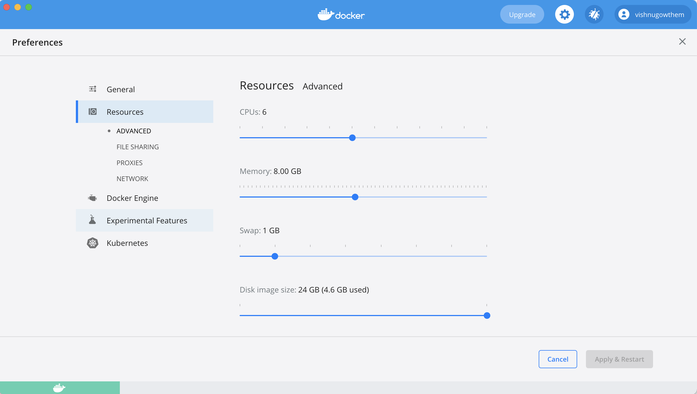

# The Anovos Docs

Everything you need to know about Anovos and its major component microservices.
​
## What is Anovos?

Anovos is a an open source project, built by data scientist for the data science community, that brings automation to the feature engineering process. By rethinking ingestion and transformation, and including deeper analytics, drift identification, and stability analysis, Anovos improves productivity and helps data scientists build more resilient, higher performing models.

Interested in contributing? Check out our [Contributors' Page](/community/contributing/).

## What's Powering Anovos?

Anovos is built on a curated  of open source libraries, including: 

The Anovos project is licensed under the terms of the [Apache 2.0 License](http://www.apache.org/licenses/LICENSE-2.0).

However, Anovos includes several third-party Open-Source libraries, which are licensed under their own respective Open-Source licenses.

- [Apache Spark](https://github.com/apache/spark)
- [Pandas](https://github.com/pandas-dev/pandas)
- [scripy](https://github.com/scipy/scipy)
- [scikit-learn](https://github.com/scikit-learn/scikit-learn/)
- [oblib](https://github.com/joblib/joblib)
- [boto3](https://github.com/boto/boto3)
- [pyarrow](https://github.com/apache/arrow)
- [sparkpickle](https://github.com/src-d/sparkpickle/)
- [s3path](https://github.com/liormizr/s3path)
- [statsmodels](https://github.com/statsmodels/statsmodels)
- [pybind11](https://github.com/pybind/pybind11)
- [popmon](https://github.com/ing-bank/popmon/)
- [seaborn](https://github.com/mwaskom/seaborn)
- [varclushi](https://github.com/jingtt/varclushi)
- [pytest](https://pytest.org/)
- [datapane](https://github.com/datapane/datapane/)

# Getting Started with Anovos
First time using Anovos? No worries, here's an easy way to get started:
## Steps to Install ANOVOS

## Installation via public registry

To install ANOVOS package via pypi, please execute the following commands:  

`pip3 install anovos`

## Installation via Git

To install ANOVOS package via git, please execute the following commands:  

`pip3 install "git+https://github.com/anovos/anovos.git"`

## Get Started

Once installed, packages can be imported and the required functionality can be called in the user flow in any application or notebook.  
Refer to the following links to get started :

- quick-start guide
- [example notebooks](https://github.com/anovos/anovos/tree/main/notebooks)
- [documentation](https://docs.anovos.ai)

## Steps to Run ANOVOS using spark-submit

After checking out via Git clone, please follow the below instructions to run the E2E ML Anovos Package on the sample income dataset: 

1. First execute the following command to clean folder, build the latest modules: 
	
	`make clean build`

2. There are 2 ways to run using spark-submit after this:

- Follow A, if you have a working environment already and would just like to use the same configs. (Note: version dependencies are to be ensured by user)
- Follow B, if you want to run via dockers

## A. Running via User's local environment

1. Check the pre-requisites - ANOVOS requires Spark (2.4.x), Python (3.7.*), Java(8). Check version using the following commands: 

	`spark-submit --version` 
	`python --version` 
	`java -version`

2. Set environment variables - `$JAVA_HOME`, `$SPARK_HOME`, `$PYSPARK_PYTHON`, and `$PATH`
3. Ensure spark-submit and pyspark is working without any issues.
4. Execute the following commands to run the end to end pipeline: 

	`cd dist/` 
	`nohup ./spark-submit.sh > run.txt &`

5. Check result of end to end run

	`tail -f run.txt`

## B. Running via Dockers

Note: Kindly ensure the machine has ~15 GB free space atleast when running using Dockers

1. Install docker on your machine (https://docs.docker.com/get-docker/)
2. Set docker settings to use atleast 8GB memory and 4+ cores. Below image shows setting docker settings on Docker Desktop:

3. Ensure dockers is successfully installed by executing the following commands to check docker image and docker container respectively:
	`docker image ls` 
	`docker ps`

4. Create docker image with the following command: (Note: Step #1 should have copied a "Dockerfile" to the directory the following command is being executed in)
	
	`docker build -t mw_ds_feature_machine:0.1 .`

5. Check if docker image was successfully created: 

	`docker image ls`

6. Run the docker container using the following command:

	`docker run -t -i -v $(PWD):/temp mw_ds_feature_machine:0.1`

7. Check if docker container is successfully running: 

	`docker ps -a`

8. To explore the generated output folder, execute the following commands:

	`docker exec -it <container_id> bash`

9. Once run has completed please exit the docker run by sending SIGINT - `^C` (CTRL + C)

## Running on custom dataset

The above E2E ANOVOS package run executed for the sample income dataset can be customized and run for any user dataset.  
This can be done configuring the `config/config.yaml` file and by defining the flow of run in `src/main.py` file.

## ANOVOS Package Documentation
Please find the detailed documentation of ANOVOS package here.

## Reference Links
- Setting up pyspark and installing on Windows from [Towards Data Science](https://towardsdatascience.com/installing-apache-pyspark-on-windows-10-f5f0c506bea1)

## Get Help

Need a little help getting started? We're here!

- Check out the [FAQs](https://Anovos.org/faq/) - When there are questions, we document the answers.
- Join the [MLOps Commuhity](https://slack.cncf.org/). Look for the `#Anovos` channel.
- Submit an issue on [Github](https://github.com/Anovos/).
