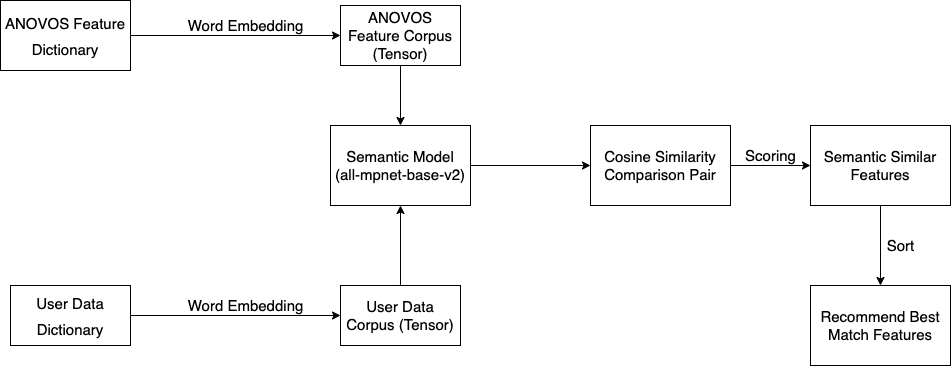

# Feature Mapper

Feature engineering has always played a crucial role in solving problems related to machine learning (ML).
Features and predictors determine whether machine learning projects are successful or not.

However, coming up with intuitive features is not an easy task.
Identifying the right features to build is challenging and requires both domain knowledge and expertise in the
technical aspects of machine learning.
In fact, 80% of data scientists' time is spent on data wrangling and feature engineering,
while only 20% is spent on fine-tuning and testing the models.
Building features from scratch and figuring out what features they should use to create models is a
daunting cold-start problem for any data scientist.

There are many tools that help data scientists to narrow down the features,
but they are always either not scalable, or complicated to understand and operate.
Within _Anovos_, we've launched an open-source tool, the Feature Explorer and Mapper (FER) module,
to help the machine learning community tackle the cold-start problem.

With Feature Explorer and Mapper, we mainly address two problems:

- Create a platform for data scientists to explore available and already used features based on their
  in industries/domains and use cases of interest
- The Feature Mapper helps data scientists in identifying better features based on the data they have on hand

The Feature Explorer and Mapper both use semantic-similarity-based language modeling based
on recent Natural Language Processing (NLP) techniques.
Semantic matching aims to determine the similarity between words, lines, and sentences through multiple metrics.

In this module, we use [all-mpnet-base-v2](https://huggingface.co/sentence-transformers/all-mpnet-base-v2)
as our semantic model.
This model is based on Microsoft’s [Mpnet](https://arxiv.org/abs/2004.09297) base model
that offers masked and permuted pre-training for language understanding.
Its performance beats BERT, XLNet, and RoBERTa in language modeling and text recognition.

The important features of this model are:

- Trained on more than a billion training pairs, including approximately 300 million research paper citation pairs
- Fine-tuned using cosine similarity from sentence pairs, then apply cross entropy loss by comparing true pairs

Our solution consists of three main steps:

- Convert textual data into tensors using the pretrained model
- Compute similarity scores of each input attribute name and description across both corpora
  (_Anovos_ Feature Corpus & the user-defined data dictionary corpus)
- Sort the results and get the matches for each input feature based on its scores

The following diagram illustrates this workflow of the Feature Explorer and Mapper:

