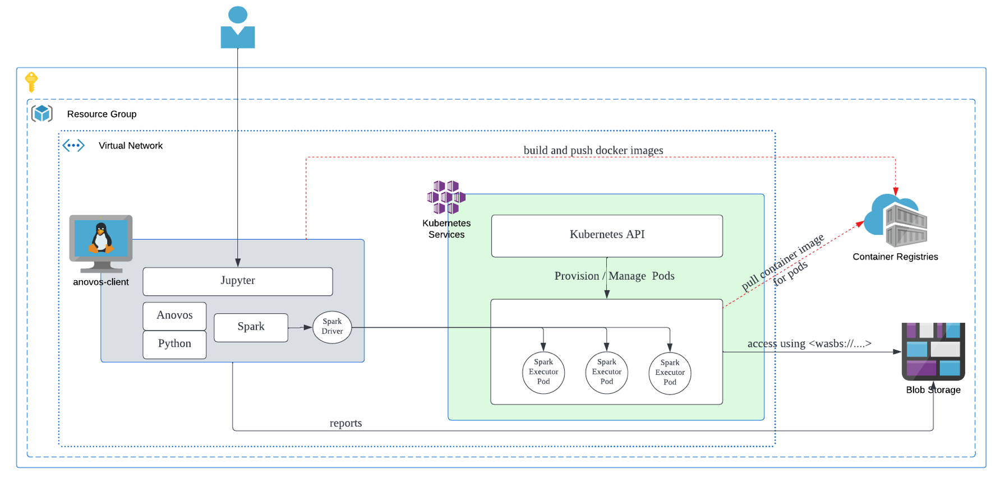
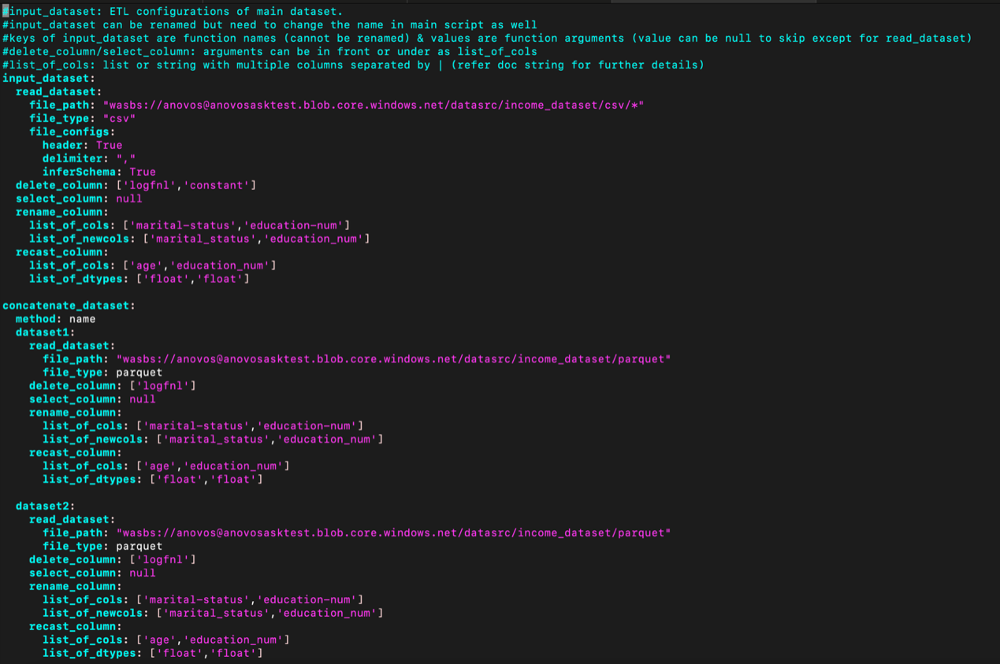

# Setting up Anovos on Azure Kubernetes (AKS)
In this section we detailed how to run on Anovos on Azure Kubernetes Environment (AKS).

## Azure Cloud Infrastructure
Firstly we detail  why the cloud architecture plays a cruclai role in AKS setup. Although cloud architectures can vary depending on custom configurations, the following diagram represents the most common structure and flow of data for the Anovos on Azure K8s.


 - `anovos-client` is a Azure VM. It serves as the platform from which the Spark jobs are submitted to the K8s cluster.
 - `Kubernetes-services` can be any K8s setup, in this case it represents Azure AKS.
 - `container-registries` to store the anovos-spark docker images for K8s.
 - Azure Storage containers to store the data-sets to be used in Anovos workflow and the resulting data-sets and reports are also stored there.

## Requirements
-   Resource Group requirements
	- Dedicated resource group to contain all the resources to be created for the anovos project.
-   VNET requirements
    - Azure VM and AKS to be located within the same VNET. 
    - Subnet to allow public access (not via NAT gateway).
    - Different subnet for AKS and VM is recommended.
 		- VM subnet size to be at least /27 CIDR range. 
 		- AKS subnet size to be at least /24 CIDR range or bigger.
-   VM requirements
 	- Ubuntu 20 recommended
 	- Single VM with at least 8 core CPU, 16 GB RAM and 128 GB disk.
 	- Install necessary pks and software(incl but not limited to anovos, spark, jdk)
 	- Managed Identity of the VM to have permissions to AKS, Container Registry and Blob Storage. 
 		- Ex: Contributor Role with Resource Group scope, for the VM’s managed identify.
-   AKS requirements
 	- Dedicated cluster will be preferred but optional.
 	- Dedicated namespace, service principals for Anovos, recommended.
 	- Sufficient permissions to allow AKS to pull images from ACR.
-   Azure Storage Container
 	- Dedicated container for Anovos to store all input dataset, results and reports.
 		- At this point, the code accepts only single container as it is capable of accepting only one SAS token.
 	- An SAS token with sufficient validity and full permissions on the anovos containers. This will be used within the python code and spark configuration.
 - Azure Container Registry
 	- To store anovos-spark docker image, for the executor pods.

## Step 1: Setup Anovos Client on VM
-   Software Reqired on VM
    - Python 3.9
    - Spark 3.x
    - JDK 8
    - Maven
    - Jupyter
    - zure CLI and AZCOPY
    - Kubectl
    - Azure CLI and AZCOPY
    - Docker
    - Anovos

-   Switch to root user
```
# Switch to root user
$ sudo su -
```

-   Install Azure CLI and Azcopy
```
#Install AZ CLI
$ curl -sL https://aka.ms/InstallAzureCLIDeb | sudo bash

#Download AzCopy
$ wget https://aka.ms/downloadazcopy-v10-linux
	 
#Expand Archive
$ tar -xvf downloadazcopy-v10-linux
	 
#(Optional) Remove existing AzCopy version
$ rm /usr/bin/azcopy
	 
#Move AzCopy to the destination you want to store it
$ cp ./azcopy_linux_amd64_*/azcopy /usr/bin/

#Ensure azcopy has execute permissions for user, group and others.
$ chmod +x /usr/bin/azcopy
```

-   Install Kubectl
```
$ apt-get update
$ apt-get install -y apt-transport-https ca-certificates curl

$ curl -fsSLo /usr/share/keyrings/kubernetes-archive-keyring.gpg https://packages.cloud.google.com/apt/doc/apt-key.gpg

$ echo "deb [signed-by=/usr/share/keyrings/kubernetes-archive-keyring.gpg] https://apt.kubernetes.io/ kubernetes-xenial main" | sudo tee /etc/apt/sources.list.d/kubernetes.list

$ apt-get update
$ apt-get install -y kubectl
```

-   Install JDK 8
```
$ apt-get update
$ apt-get install openjdk-8-jdk
```

-   Install Maven
```
$ apt install maven
```

-   Install Docker Client
```
# Note: Python should be set to 3.8 (default for Ubuntu 20)

# Verify python version
$ python3 -V

# Install docker client
$ apt-get install apt-transport-https ca-certificates curl software-properties-common
	
$ curl -fsSL https://download.docker.com/linux/ubuntu/gpg | sudo apt-key add -
	
$ add-apt-repository "deb [arch=amd64] https://download.docker.com/linux/ubuntu  $(lsb_release -cs)  stable"
	
$ apt update
$ apt-get install docker-ce
```

-   Install Python 3.9
```
# Install Python3.9
$ apt-get update
$ apt install software-properties-common
$ add-apt-repository ppa:deadsnakes/ppa
$ apt-get update
$ apt install python3.9

# Set python3.9 as default
$ update-alternatives --install /usr/bin/python3 python3 /usr/bin/python3.8 2
	
$ update-alternatives --install /usr/bin/python3 python3 /usr/bin/python3.9 1
	
$ update-alternatives --config python3


# [Optional] The following is required to fix the error with apt-pkg
$ cd /usr/lib/python3/dist-packages
$ cp -p apt_pkg.cpython-34m-i386-linux-gnu.so apt_pkg.so or ln -s apt_pkg.cpython-38-x86_64-linux-gnu.so apt_pkg.so

$ apt install python3.9-distutils
$ apt install python3-pip
$ python3.9 -m pip install --upgrade pip
$ apt install python3.9-venv

$ pip3 install pyspark==3.2.1
$ pip3 install py4j
```

-   Install Jupyter Notebook
```
$ pip3 install jupyter
```

-   Configure Jupyter
```
$ jupyter notebook --generate-config  

# add the following line in jupyter_notebook_config.py
c.NotebookApp.ip = '*'

$ jupyter notebook password
```

-   Install Spark
```
$ wget https://dlcdn.apache.org/spark/spark-3.2.1/spark-3.2.1-bin-hadoop3.2.tgz
$ tar -xvf spark-3.2.1-bin-hadoop3.2.tgz
```

-   Clone Anovos Repo
```
$ git clone https://github.com/anovos/anovos.git
```

-   Install Anovos
(This step is required everytime when we want to use the updated Anovos code)
```
# go to the root folder of Anovos repo and build python wheel file 
$ python3 -m build --wheel --outdir dist/ .

# uninstall the old version of Anovos
$ pip3 uninstall anovos

# install the latest Anovos from .whl 
$ pip3 install dist/xxx.whl
```

-   Configure env variables for `azureuser`
```
# Set SPARK_HOME
$ echo -e "export SPARK_HOME=/home/azureuser/spark-3.2.1-bin-hadoop3.2" >> ~/.profile

# Set JAVA_HOME
$ echo -e "export JAVA_HOME=/usr/lib/jvm/java-8-openjdk-amd64" >> ~/.profile

# Set PYSPARK
$ echo -e "export PYSPARK_PYTHON=/usr/bin/python3" >> ~/.profile
$ echo -e "export PYSPARK_DRIVER_PYTHON=/usr/bin/python3" >> ~/.profile

# Set PATH
$ echo -e 'export PATH="$SPARK_HOME/bin:$PATH"' >> ~/.profile

# Source the new Env Variables
$ source ~/.profile
```

-   Configure kubectl (NOTE: **Substitute correct values for variables within `< >`**)
```
$ az login --identity 
$ az aks get-credentials --resource-group <resource-grp> --name <k8s-name> --subscription <subscription>
```

-   Create Namespace in K8s cluster
```
$ kubectl get namespace
$ kubectl create namespace anovos
```

-   Create AKS Service Accoun
```
$ kubectl get serviceaccount --namespace=anovos
$ kubectl create serviceaccount spark --namespace=anovos

$ kubectl get clusterrolebinding --namespace=anovos
$ kubectl create clusterrolebinding spark-role --clusterrole=edit --serviceaccount=anovos:spark --namespace=anovos
```

## Step 2: Build Anovos Spark Container
We need to custom build a docker image to be used by K8s to run the spark executor pods. 

**Substitute correct values for variables within `<>`**

-   Authenticate using Azure Managed Identity
```
$ sudo az login –-identity
```

-   Login to the Azure Container Registry 
```
$ sudo az acr login --name <registryname>
```

-   Build and Push Docker for Executor Pods
```
# build Python wheel file, can copy .whl file under /home/azureuser/spark-3.2.1-bin-hadoop3.2/python
$ python3 -m build --wheel --outdir dist/ .
$ cp dist/anovos-0.3.0-py2.py3-none-any.whl /home/azureuser/spark-3.2.1-bin-hadoop3.2/pythonanovos-0.3.0-py2.py3-none-any.whl

$ cd /home/azureuser/spark-3.2.1-bin-hadoop3.2 

# build Dockerfile as image. Replace the Dockerfile path with the correct one if required
$ sudo ./bin/docker-image-tool.sh -r <registryname>.azurecr.io -t <tag> -p ../Dockerfile build

# push Docker image to registry
$ sudo docker push <registryname>.azurecr.io/spark-py:<tag>
```
NOTE: **Dockerfile is provided at the end of this document.**

## Step 3: Run Anovos
### Using Spark-Submit
To run Anovos, we can write our own workflow file to call the different modules and submodules of Anovos, as per our need and execute in any spark application by just importing Anovos and using it. 
Alternatively, there is also a ready-made workflow file in the repo that can be modified to call the different modules in a pre-set order based on the config file and this can be used to executed via spark-submit.


1.	Get the latest jars and main.py and config file from the repo
```
# Clone the repo
$ sudo git clone https://github.com/anovos/anovos.git
```
Here is an example of spark-submit script (NOTE: **Substitute correct values for variables within `< >`**)
```
./bin/spark-submit \
--master k8s://https://<K8s-master-dns>:443 \
--deploy-mode client \
--name anovos-job-01 \
--class org.apache.spark.examples.SparkPi \
--conf spark.executor.instances=10 \
--conf spark.executor.cores=4 \
--conf spark.executor.memory=16g \
--conf spark.kubernetes.namespace=anovos \
--conf spark.kubernetes.authenticate.driver.serviceAccountName=spark \
--conf spark.kubernetes.container.image=<registryname>.azurecr.io/spark-py:<tag> \
--conf spark.hadoop.fs.azure.sas.<container>.<storageaccount>.blob.core.windows.net="<sas_token>" \
--packages org.apache.hadoop:hadoop-azure:3.2.0,com.microsoft.azure:azure-storage:8.6.3,org.apache.spark:spark-avro_2.12:3.2.1 \
--conf spark.driver.extraJavaOptions="-Divy.cache.dir=/tmp -Divy.home=/tmp" \
--conf spark.executor.extraJavaOptions="-Dlog4j.configuration=file://$SPARK_HOME/conf/log4j.properties" \
--conf spark.driver.extraJavaOptions="-Dlog4j.configuration=file://$SPARK_HOME/conf/log4j.properties"  \
--conf spark.kubernetes.file.upload.path=wasbs://<container>@<storageaccount>.blob.core.windows.net \
--jars /home/azureuser/anovos/jars/${histogrammar_jar},/home/azureuser/anovos/jars/${histogrammar_sql_jar} \
/home/azureuser/anovos/main.py \
/home/azureuser/anovos/config/configs_income_azure_ak8s.yaml \
ak8s \
'{"fs.azure.sas. <container>.<storageaccount>.blob.core.windows.net":"<sas_token>"}'
```
	- main.py is available from anovos/src/main/main.py
	- sample pre-set configs.yaml file from anovos/config/configs.yaml. 
		- Edit configs.yaml to enter correct values for  Azure storage @ wasbs://….
		
	- Anovos uses few external third party packages for some of its sub modules and we specify its jars using the --jars tag. This is found from anovos/jars/*.jar in the repo.
    

2.	There is a keyword passed as argument to the main.py along with config file specifying the run-type for Anovos. Current options are
	- local – for local run
	- emr – for AWS EMR based run
	- databricks – for runs using a DBFS file system
	- ak8s – for runs on Azure K8s setup reading and writing data to Azure Blob Storage.

3.	The final report should be generated at two places
	- local path where spark-submit is being executed from, as "ml_anovos_report.html" which can be opened in Google Chrome browser 
	- in the final_report path specified in the configs.yaml file.

More in depth documentation in each of the modules and api docs can be found at <https://docs.anovos.ai>


## Using Jupyter Notebook
Running Anovos on Jupyter notebook is straightforward as using any python package.  

Kindly refer to the https://github.com/anovos/anovos/tree/main/examples in repo for sample notebooks for each module or the startup-guide for anovos to do a quick run on Jupyter.
Here is an example of how to set SparkConf in Notebook
```
# set run type variable
run_type = "ak8s" # "local", "emr", "databricks", "ak8s"

#For run_type Azure Kubernetes, run the following block 
import os
from pyspark import SparkContext, SparkConf
from pyspark.sql import SparkSession

if run_type == "ak8s":
    fs_path = "spark.hadoop.fs.azure.sas.<container>.<storageaccount>.blob.core.windows.net"
    auth_key="<sas_token>"
    master_url="k8s://https://<K8s-master-dns>:443"
    docker_image="<registryname>.azurecr.io/spark-py:<tag>"
    kubernetes_namespace ="anovos"

    # Create Spark config for our Kubernetes based cluster manager
    sparkConf = SparkConf()
    sparkConf.setMaster(master_url)
    sparkConf.setAppName("Anovos_pipeline")
    sparkConf.set("spark.submit.deployMode","client")
    sparkConf.set("spark.kubernetes.container.image", docker_image)
    sparkConf.set("spark.kubernetes.namespace", kubernetes_namespace)
    sparkConf.set("spark.executor.instances", "4")
    sparkConf.set("spark.executor.cores", "4")
    sparkConf.set("spark.executor.memory", "16g")
    sparkConf.set("spark.kubernetes.pyspark.pythonVersion", "3")
    sparkConf.set("spark.kubernetes.authenticate.driver.serviceAccountName", "spark")
    sparkConf.set(fs_path,auth_key)
    sparkConf.set("spark.kubernetes.authenticate.serviceAccountName", "spark")
    sparkConf.set("spark.jars.packages", "org.apache.hadoop:hadoop-azure:3.2.0,com.microsoft.azure:azure-storage:8.6.3,io.github.histogrammar:histogrammar_2.12:1.0.20,io.github.histogrammar:histogrammar-sparksql_2.12:1.0.20,org.apache.spark:spark-avro_2.12:3.2.1")

    # Initialize our Spark cluster, this will actually
    # generate the worker nodes.
    spark = SparkSession.builder.config(conf=sparkConf).getOrCreate()
    sc = spark.sparkContext

#For other run types import from anovos.shared.
else:
    from anovos.shared.spark import *
    auth_key = "NA"
```


## Dockerfile
```
ARG base_img

FROM $base_img
WORKDIR /

# Reset to root to run installation tasks
USER 0

RUN mkdir ${SPARK_HOME}/python
COPY python/anovos-0.3.0-py2.py3-none-any.whl ${SPARK_HOME}/python/anovos-0.3.0-py2.py3-none-any.whl
RUN apt-get update && \
    apt install -y wget python3 python3-pip && \
    pip3 install --upgrade pip setuptools && \
    pip3 install ${SPARK_HOME}/python/anovos-0.3.0-py2.py3-none-any.whl && \
    rm -r /root/.cache && rm -rf /var/cache/apt/*

COPY python/pyspark ${SPARK_HOME}/python/pyspark
COPY python/lib ${SPARK_HOME}/python/lib

WORKDIR /opt/spark/work-dir

# Download hadoop-azure, azure-storage, and dependencies (See above)
RUN wget --quiet https://repo1.maven.org/maven2/org/apache/hadoop/hadoop-azure/3.2.0/hadoop-azure-3.2.0.jar -O /opt/spark/jars/hadoop-azure-3.2.0.jar
RUN wget --quiet https://repo1.maven.org/maven2/com/microsoft/azure/azure-storage/8.6.3/azure-storage-8.6.3.jar -O /opt/spark/jars/azure-storage-8.6.3.jar
RUN wget --quiet https://repo1.maven.org/maven2/org/apache/httpcomponents/httpclient/4.5.2/httpclient-4.5.2.jar -O /opt/spark/jars/httpclient-4.5.2.jar
RUN wget --quiet https://repo1.maven.org/maven2/org/eclipse/jetty/jetty-util-ajax/9.3.24.v20180605/jetty-util-ajax-9.3.24.v20180605.jar -O /opt/spark/jars/jetty-util-ajax-9.3.24.v20180605.jar
RUN wget --quiet https://repo1.maven.org/maven2/org/codehaus/jackson/jackson-mapper-asl/1.9.13/jackson-mapper-asl-1.9.13.jar -O /opt/spark/jars/jackson-mapper-asl-1.9.13.jar
RUN wget --quiet https://repo1.maven.org/maven2/org/codehaus/jackson/jackson-core-asl/1.9.13/jackson-core-asl-1.9.13.jar -O /opt/spark/jars/jackson-core-asl-1.9.13.jar
RUN wget --quiet https://repo1.maven.org/maven2/org/wildfly/openssl/wildfly-openssl/1.0.4.Final/wildfly-openssl-1.0.4.Final.jar -O /opt/spark/jars/wildfly-openssl-1.0.4.Final.jar
RUN wget --quiet https://repo1.maven.org/maven2/org/apache/httpcomponents/httpcore/4.4.4/httpcore-4.4.4.jar -O /opt/spark/jars/httpcore-4.4.4.jar
RUN wget --quiet https://repo1.maven.org/maven2/commons-logging/commons-logging/1.1.3/commons-logging-1.1.3.jar -O /opt/spark/jars/commons-logging-1.1.3.jar
RUN wget --quiet https://repo1.maven.org/maven2/commons-codec/commons-codec/1.11/commons-codec-1.11.jar -O /opt/spark/jars/commons-codec-1.11.jar
RUN wget --quiet https://repo1.maven.org/maven2/org/eclipse/jetty/jetty-util/9.3.24.v20180605/jetty-util-9.3.24.v20180605.jar -O /opt/spark/jars/jetty-util-9.3.24.v20180605.jar
RUN wget --quiet https://repo1.maven.org/maven2/com/fasterxml/jackson/core/jackson-core/2.9.4/jackson-core-2.9.4.jar -O /opt/spark/jars/jackson-core-2.9.4.jar
RUN wget --quiet https://repo1.maven.org/maven2/org/slf4j/slf4j-api/1.7.12/slf4j-api-1.7.12.jar -O /opt/spark/jars/slf4j-api-1.7.12.jar
RUN wget --quiet https://repo1.maven.org/maven2/org/apache/commons/commons-lang3/3.4/commons-lang3-3.4.jar -O /opt/spark/jars/commons-lang3-3.4.jar
RUN wget --quiet https://repo1.maven.org/maven2/com/microsoft/azure/azure-keyvault-core/1.0.0/azure-keyvault-core-1.0.0.jar -O /opt/spark/jars/azure-keyvault-core-1.0.0.jar
RUN wget --quiet https://repo1.maven.org/maven2/com/google/guava/guava/20.0/guava-20.0.jar -O /opt/spark/jars/guava-20.0.jar

ENTRYPOINT [ "/opt/entrypoint.sh" ]
```

