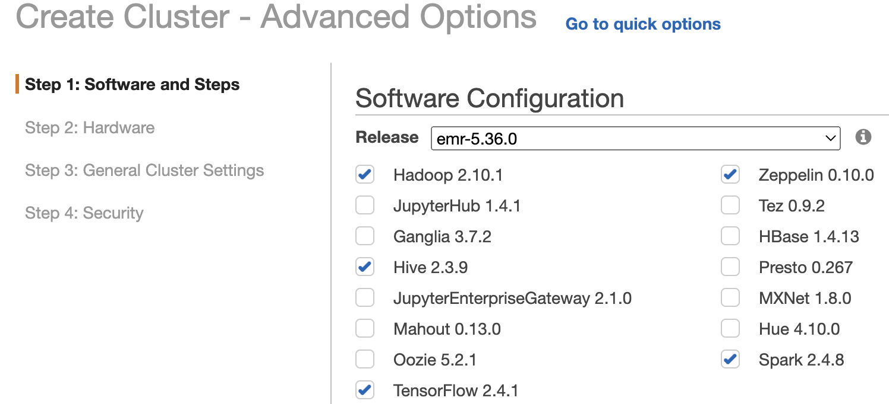
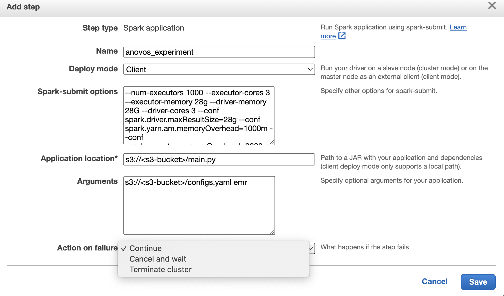
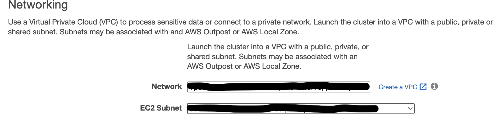
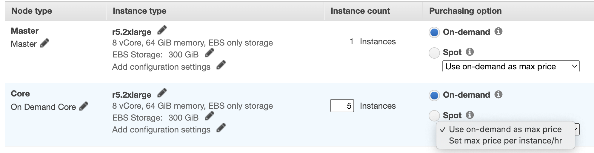
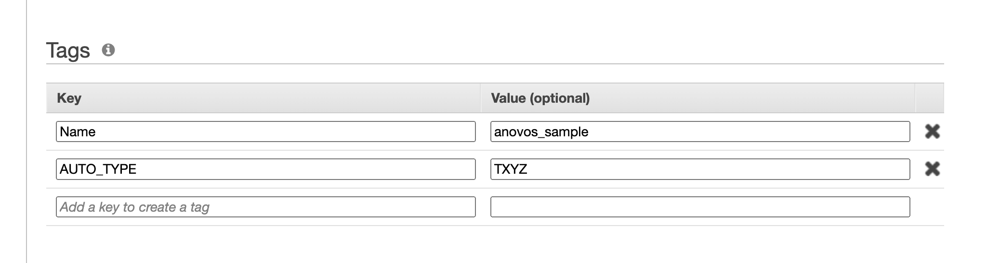
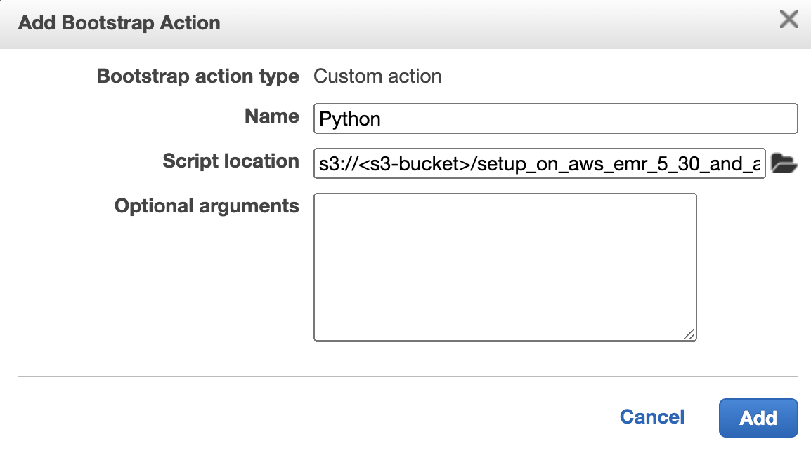
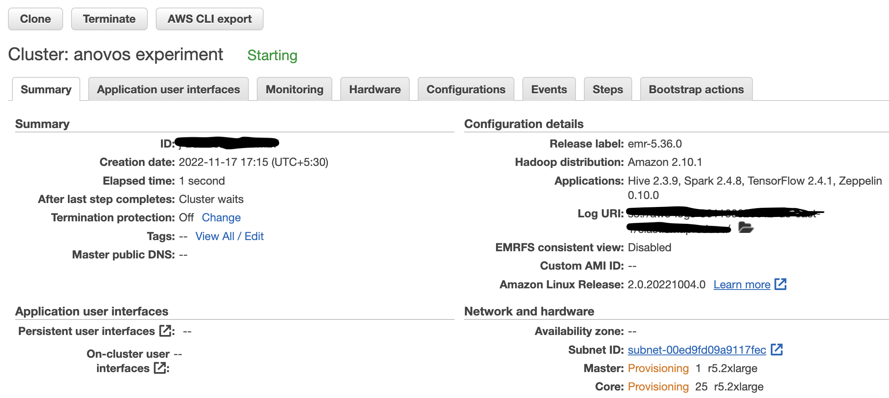
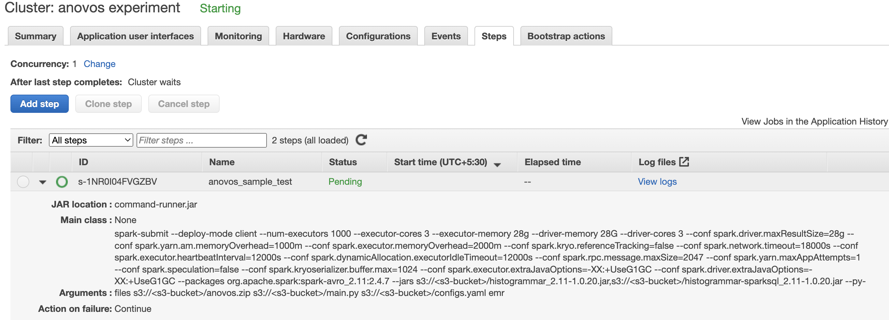

# Setting up Anovos on AWS EMR

For large workloads, you can set up _Anovos_ on [AWS EMR](https://aws.amazon.com/emr/).
AWS EMR provides managed services to easily run Apache Spark and other big data workloads.

## Downloading & Installing Anovos

There are two ways to install Anovos on AWS environment. See below for further details.

1.Firstly by Installing Anovos dependency packages from Anovos developmental github version

For that, clone the Anovos repository into your local environment using the following command:

```shell
git clone --depth 1 https://github.com/anovos/anovos.git
```

Then you can copy the [requirements.txt](https://github.com/anovos/anovos/blob/main/requirements.txt) to an accessible s3 bucket, correspondingly edit the first line to use the following file as part of bootstrap actions when starting the cluster - `setup_on_aws_emr_5_30_and_above.sh`

If you need to make custom modifications to Anovos or need access to new features or bugfixes that have not been released yet, you can choose this option. 


2.Secondly by installing anovos through PyPI (Latest released version)


You can use `setup_on_aws_emr_5_30_and_above_latest_release_version.sh` file as part of the bootstrap actions when starting the cluster to directly install anovos (latest release version):

```bash
sudo pip3 install --upgrade cython
sudo pip3 install anovos
```

Note : We will use these methods for installing anovos as part of Step 4 (during bootstrapping actions) when Configuring and launching an Anovos workflow as an AWS EMR Job.


## Create a workflow script

To launch the workflow on AWS EMR, we need a single Python script as the entry point.
Hence, we'll create a `main.py` script that invokes the _Anovos'_ workflow runner:

```python
import sys
from anovos import workflow

workflow.run(config_path=sys.argv[1], run_type="emr")
```

It takes an [_Anovos_ configuration file](../config_file.md) and submits it to the _Anovos_
workflow runner, together with the `run_type` specific to AWS EMR.

## Copy all required files into an S3 bucket

Copy the `main.py` script created in the previous step to [AWS S3](https://aws.amazon.com/s3/):

For copying the below files, we need to firstly clone the Anovos repository into your local environment using the following command:

```shell
git clone --depth 1 https://github.com/anovos/anovos.git
```

_**Note**: Using the `--branch` flag allows you to select a specific release of Anovos._
_For example, adding `--branch v1.0.1` will give you the state of the 1.0.1 release._
_If you omit the flag, you will get the latest development version of Anovos._

After cloning, go to the `anovos` directory and execute the following command to clean and
build the latest modules in the `dist` folder:

```shell
make clean build
```
Now all files which we are going to copy in to s3 bucket are avaialable in the local environment. We can copy the following below files to [AWS S3](https://aws.amazon.com/s3/) :

- `/anovos/dist/anovos.zip`
  This file contains all Anovos modules. You will need the compressed (.zip) file for importing the modules as –py-files.
  - **Note**: we can use this file only when we are trying to install Anovos by installing Anovos dependency packages from Anovos developmental github version as mentioned above in downloading and installing anovos section.
- `/anovos/dist/data/income_dataset` (optional)
  This folder contains our demo dataset, the `income dataset`. We have used this dataset here as an example for this tutorials.
- `/anovos/dist/configs.yaml`
  This is the sample _Anovos_ configuration file that describes how the `income dataset`
  should be analyzed and processed.
  
  Ensure that all input and output paths in `configs.yaml`, such as `final_report_path`, `file_path`,
  `appended_metric_path` or `output_path`, are set to the desired S3 locations.
  You can also make other changes to the workflow. For example, you can define which columns from the input dataset are used in the workflow. 
  To try it yourself, find the delete_column configuration in the input_dataset block and add the column workclass to the list of columns to be deleted:

  ```yaml
  delete_column: ['logfnl','workclass']
  ```
  To learn more about defining workflows through config files, see [📖 Configuring Workloads](../config_file.md).

- `/anovos/bin/aws_bootstrap_files/setup_on_aws_emr_5_30_and_above.sh`
  This shell script installs all the packages that are required to run _Anovos_ on EMR.
  Copy the [requirements.txt](https://github.com/anovos/anovos/blob/main/requirements.txt)
  in the repo to available S3 bucket.
  Edit the first line in `setup_on_aws_emr_5_30_and_above.sh` to fit your project.
  Now you can use it as a bootstrap file for AWS EMR. 
  This file will be useful when installing Anovos dependency packages from Anovos developmental github version.

- `/anovos/bin/aws_bootstrap_files/setup_on_aws_emr_5_30_and_above_latest_release_version.sh`
  We can only use this file as part of the bootstrap actions when we are installing anovos through PyPI(latest release version).

- `/anovos/data/metric_dictionary.csv`
  This is a static dictionary file for the different metrics generated by _Anovos_ in the
  [Data Report](../data-reports/overview.md).
  It helps generate the _Wiki_ tab in the [final _Anovos_ report](../data-reports/final_report.md),
  where the metrics of the different modules and submodules are summarized.
- `/anovos/jars/histogrammar*.jar`
  These jars contain external dependencies of _Anovos_.
  Specify the correct version 2.12 or 2.11, based on your environment’s Spark version.
  If you're using Spark 3.x, download the following files and upload them to s3:

  - [`io.github.histogrammar.histogrammar_2.12-1.0.20.jar`](https://mvnrepository.com/artifact/io.github.histogrammar/histogrammar_2.12/1.0.20)
  - [`io.github.histogrammar.histogrammar-sparksql_2.12-1.0.20.jar`](https://mvnrepository.com/artifact/io.github.histogrammar/histogrammar-sparksql_2.12/1.0.20)

    If you're using Spark 2.x, download the following files and upload them to s3:

  - [`io.github.histogrammar.histogrammar_2.11-1.0.20.jar`](https://mvnrepository.com/artifact/io.github.histogrammar/histogrammar_2.11/1.0.20)
  - [`io.github.histogrammar.histogrammar-sparksql_2.11-1.0.20.jar`](https://mvnrepository.com/artifact/io.github.histogrammar/histogrammar-sparksql_2.11/1.0.20)

To learn how to install the AWS CLI, see the
[AWS documentation](https://docs.aws.amazon.com/cli/latest/userguide/getting-started-install.html).

You can use the following command to copy files from your local machine to an S3 bucket:

```shell
aws s3 cp --recursive  <local file path> <s3 path> --profile  <profile name>
```

## Configure and launch an Anovos workflow as an AWS EMR Job
Once all files have been copied to s3 bucket, we can create an AWS EMR job that starts a cluster and launches the Anovos workflow.

Here's an example that shows step by step how to create a cluster and add steps for launching the Anovos workflow.
### Step1 : Software Configurations:
Users can go to Create cluster - Advanced options and use the following software configuration:



We have used Emr-5.36.0 for this example. we can select following softwares as shown in the image for anovos run.The softwares versions will automatically come once we select emr versions.
- Hadoop
- Spark
- Hive
- TensorFlow

### Step2: Addition of steps for anovos workflow
Choose step type as "Spark application" and click on add step. Add step box will appear and there we can fill spark submit and argument details for launching the anovos workflow in aws emr.
A step is a unit of work you submit to the cluster. For instance, a step might contain one or more Hadoop or Spark jobs. You can also submit additional steps to a cluster after it is running.

Here is an example of spark submit and argument details for reference.



- Spark Submit details:
    - Deploy mode : `client`
    - Spark-submit options :

  ```shell
          --num-executors 1000
          --executor-cores 3
          --executor-memory 28g
          --driver-memory 28g
          --driver-cores 3
          --conf spark.driver.maxResultSize=28g
          --conf spark.yarn.am.memoryOverhead=1000m
          --conf spark.executor.memoryOverhead=2000m
          --conf spark.kryo.referenceTracking=false
          --conf spark.network.timeout=18000s
          --conf spark.executor.heartbeatInterval=12000s
          --conf spark.dynamicAllocation.executorIdleTimeout=12000s
          --conf spark.rpc.message.maxSize=2047 
          --conf spark.yarn.maxAppAttempts=1
          --conf spark.speculation=false
          --conf spark.kryoserializer.buffer.max=1024
          --conf spark.executor.extraJavaOptions=-XX:+UseG1GC
          --conf spark.driver.extraJavaOptions=-XX:+UseG1GC
          --packages org.apache.spark:spark-avro_2.11:2.4.7
          --jars /anovos/jars/histogrammar-sparksql_2.11-1.0.20.jar,/anovos/jars/histogrammar_2.11-1.0.20.jar
          --py-files {s3_bucket}/anovos.zip
  ```

When launching a cluster, the driver/worker node memory size should be more than the total configured memory.
For example, for the above config, there should be at least 28 + 2 = 30 GB per worker or driver.
So the user must select machine types with around 40 GB of RAM or more.

Example machines: - r5.2xlarge - 8 core, 64 GB.

The above histogram jars version and avro package version should follow the Scala and pyspark version.

**Note**: We can use python files (--py-files) only when we are installing anovos by installing Anovos dependency packages from Anovos developmental github version

- Application location: S3 path of main.py file
- Arguments for main.py file - `s3://<s3-bucket>/configs.yaml emr`. Here 1st argument is the s3 bucket path of config file and 2nd argument is run_type. 2nd argument is optional if we have already given in main.py file.
- Choose Action on failure as per your own wish as whether you want to do continue/cancel and wait/terminate .
Once you fill all the details, you can click in to add and go to next page in Create Cluster -  Advanced Options and in this page you need to cover networking and about cluster Nodes and Instances.

### Step 3: Networking & Cluster Nodes and Instances
For networking Section, Launch the cluster into a VPC with a public, private, or shared subnet. Subnets may be associated with an AWS Outpost or AWS Local Zone.
The image below shows an example of setting networking for reference.You can set networking as per the subnet available in your account.



After that we can come to Cluster Nodes and Instances section where we can choose the instance type, number of instances, and a purchasing option.



In this example , we have set Instance type as r5.2xlarge with 1 instance count of master node type and 5 instance count of Core node type having On-demand Purchasing option.We can choose instance type and no of instances as per dataset size and jobs complexity.

For more information about purchasing options, you can learn from 
[instance purchasing options documentation](https://docs.aws.amazon.com/emr/latest/ManagementGuide/emr-instance-purchasing-options.html) 

### Step 4: General cluster Settings and bootstrap Actions
Once Cluster Nodes and Instances set up, we can go to next page for providing cluster name and Tags.You can give name of the cluster in cluster name section which is related to your project.

A tag consists of a case-sensitive key-value pair. Tags on EMR clusters are propagated to the underlying EC2 instances.

Here in this example,the below image shows tags for reference.Users can give tags as per their own task and project.



Once general cluster Settings completed, we can move to Bootstapping Action section.Bootstrap actions are scripts that are executed during setup before Hadoop starts on every cluster node. You can use them to install software dependencies and customize your applications.

Here we are using bootstrap actions to installs all the packages that are required to run _Anovos_ on EMR.We have used two bootstrap files, first is for installing Anovos dependency packages from Anovos developmental github version and second is when we want to install anovos through PyPI(latest released version).

We can also take the reference from installing and downloading Anovos section where we have described which bootstrap files will be used in which condition.

Give the s3 bucket path of .sh script in script location as shown in the example and then click on add to add this script.



- Bootstrap Actions:
  1. For installing anovos by installing Anovos dependency packages from Anovos developmental github version, we can use this script for bootstrap actions
  - Script location: specify the bootstrap_shell_script_s3_path/setup_on_aws_emr_5_30_and_above.sh
  2. For Installing anovos through PyPI (Latest released version), use this script
  - Script location: specify the bootstrap_shell_script_s3_path/setup_on_aws_emr_5_30_and_above_latest_release_version.sh

After that we can go to next page and click on create cluster and after that cluster will start doing execution of bootstrap action and then will start steps for running anovos. We can see the summary of cluster configuration after cluster started in the figure.



Also we can see the anovos steps in the step section as shown in the figure.You can see the complete spark submit details and arguments what you have provided above.



- Final Spark Submit command example :

  ```shell
  spark-submit --deploy-mode client
               --num-executors 1000
               --executor-cores 3
               --executor-memory 28g
               --driver-memory 28G
               --driver-cores 3
               --conf spark.driver.maxResultSize=28g
               --conf spark.yarn.am.memoryOverhead=1000m
               --conf spark.executor.memoryOverhead=2000m
               --conf spark.kryo.referenceTracking=false
               --conf spark.network.timeout=18000s
               --conf spark.executor.heartbeatInterval=12000s
               --conf spark.dynamicAllocation.executorIdleTimeout=12000s 
               --conf spark.rpc.message.maxSize=2047
               --conf spark.yarn.maxAppAttempts=1
               --conf spark.speculation=false
               --conf spark.kryoserializer.buffer.max=1024
               --conf spark.executor.extraJavaOptions=-XX:+UseG1GC
               --conf spark.driver.extraJavaOptions=-XX:+UseG1GC
               --packages org.apache.spark:spark-avro_2.11:2.4.7
               --jars s3://<s3-bucket>/jars/histogrammar-sparksql_2.11-1.0.20.jar,s3://<s3-bucket>/jars/histogrammar_2.11-1.0.20.jar
               --py-files s3://<s3-bucket>/anovos.zip s3://<s3-bucket>/main.py s3://<s3-bucket>/configs.yaml emr
  ```

### step 5 : Retrieve the output
Once the job finishes successfully,the intermediate data and the report data are saved at the master_path and the final_report_path specified in the configs.yaml file. 

To retrieve the HTML report and the report data, you can either go to s3 path in the UI and copy the files, or use the CLI to copy everything to your local machine.