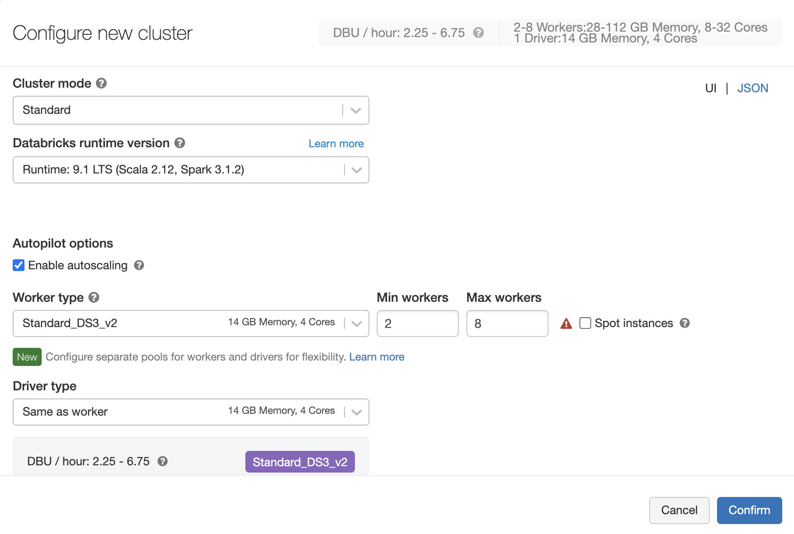
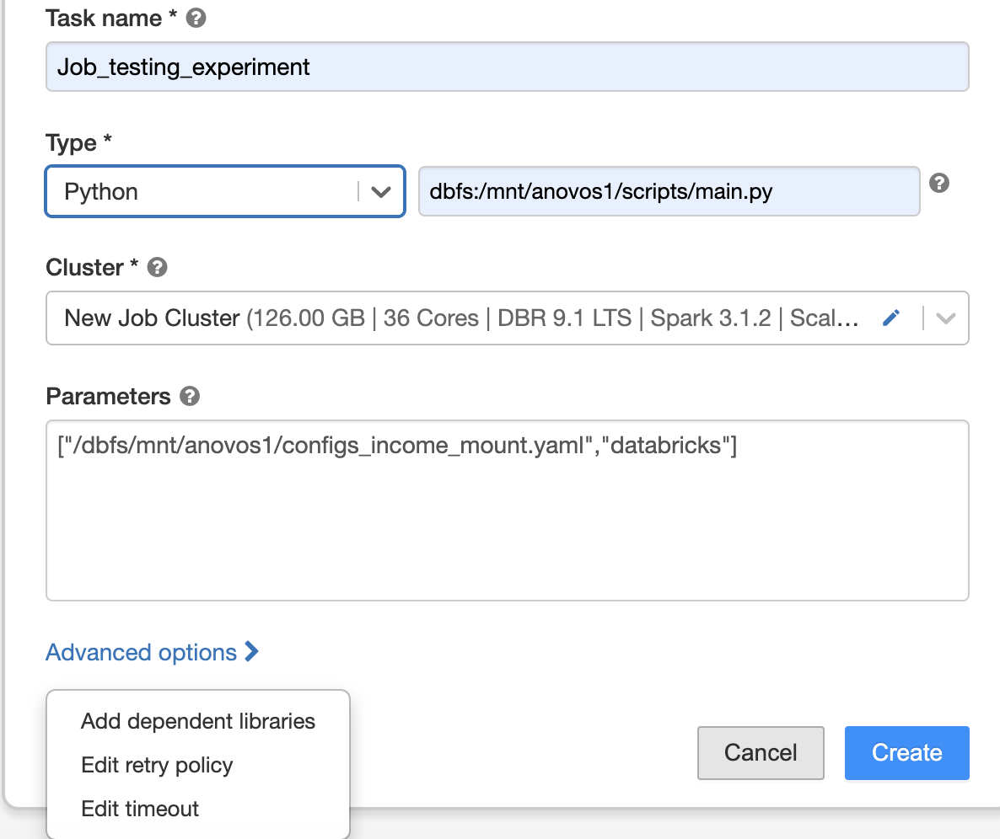
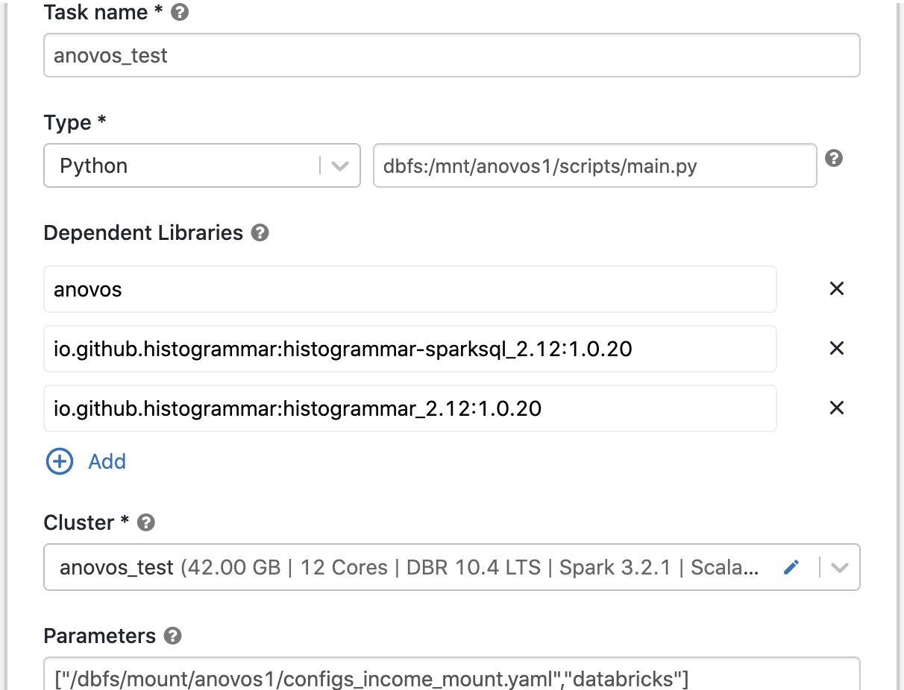

# Setting up Anovos on Azure Databricks 

[Azure Databricks](https://azure.microsoft.com/services/databricks/)
is a hosted version of [Apache Spark](https://spark.apache.org/) on [Microsoft Azure](https://azure.microsoft.com/).
It is a convenient way to handle big data workloads of Spark without having to set up and maintain your own cluster.

To learn more about Azure Databricks, have a look at
[the official documentation](https://databricks.com/introducing-azure-databricks)
or the following introductoray tutorials:
- [A beginner’s guide to Azure Databricks](https://www.sqlshack.com/a-beginners-guide-to-azure-databricks/)
- [Azure Databricks Hands-on](https://medium.com/@jcbaey/azure-databricks-hands-on-6ed8bed125c7)

Currently, _Anovos_ supports two ways of running workflows on Azure Databricks using python way: 

1.	Using DBFS directly - Generally used when dataset is present in dbfs path
2.	Mounting an Azure blob storage container to DBFS - Generally used when dataset is present in azure blob storage container and of any size

## Anovos on Azure Databricks using DBFS

The following steps are required for running _Anovos_ workloads on Azure Databricks using DBFS.

### Step 1: Install anovos packages directly from PyPI
To make the latest released version of _Anovos_ available on Azure Databricks, you need to install anovos packages directly from PyPI. The detailed instructions of installing anovos packages from PyPI is shown in step 4.

Another way to make _Anovos_ available on Azure Databricks, you need to upload a wheel file.
The easiest way to obtain it is to download directly from PyPI.
This ensures that you have the latest stable and well-tested version of _Anovos_.

You'll find the link to the latest wheel file on
[the "Download files" tab](https://pypi.org/project/anovos/#files).
If you'd like to use an older version, you can navigate to the respective version in the
[Release history](https://pypi.org/project/anovos/#history) and access the "Download files" tab
from there.

#### Alternative: Use a development version of _Anovos_

If you would like to try the latest version of _Anovos_ on Azure Databricks
(or would like to make custom modifications to the library),
you can also create a wheel file yourself.

First, clone the _Anovos_ GitHub repository to your local machine:

```shell
git clone --depth 1 <https://github.com/anovos/anovos.git>
```

_**Note**: Using the `--branch` flag allows you to select a specific release of Anovos._
_For example, adding `--branch v0.2.2` will give you the state of the 0.2.2 release._
_If you omit the flag, you will get the latest development version of Anovos, which might not_
_be fully functional or exhibit unexpected behavior._
__

After cloning, go to the `anovos` directory that was automatically created in the process
and execute the following command to clean and prepare the environment:

```shell
make clean
```

It is a good practice to always run this command prior to generating a wheel file or another kind
of build artifact.

_**Note**: To be able to create a wheel file, `wheel`, `build`, and `setuptools` need to be installed_
_in the current Python environment. You can do so by running `pip install build wheel setuptools`._

Then, to create the wheel file, run the following command directly inside the `anovos` folder:

```shell
python -m build --wheel --outdir dist/ .
```

Once the process is finished, the folder `dist` will contain the wheel file.
It will have the file extension `*.whl` and might carry the latest version in its name.

_**Note:** The version in the file name will be that of the latest version of _Anovos_,_
_even if you cloned the repository yourself and used the latest state of the code._
_This is due to the fact that the version is only updated right before new release is published._
_To avoid confusion, it's a good practice to rename the wheel file to a custom name._

### Step 2: Copy the data and workflow configuration to DBFS

To run an _Anovos_ workflow, both the data to be processed and the workflow configuration
need to be stored on DBFS.

You can either use the UI or the CLI to copy files from your local machine to DBFS.
For detailed instructions, see the respective subsections below.

In this tutorial, we will use "income dataset" and an accompanying pre-defined workflow.

You can obtain these files by cloning the _Anovos_ GitHub repository:
```shell
git clone https://github.com/anovos/anovos.git
```

You'll find the dataset under `examples/data/income_dataset` and the configuration file
under `config/configs_income_azure.yaml`.

Users can give the input dataset path and output path as dbfs path.For example, here in input_dataset section file_path kept at this dbfs path - "dbfs:/FileStore/tables/income_dataset/csv/". Users can store data in same dbfs path as given in config file or can keep input and output path in any dbfs path as per their choice and will update in config file accordingly to run the example.

input_dataset:
...
  read_dataset:
      file_path: "dbfs:/FileStore/tables/income_dataset/csv/"
...    
Update configs.yaml for all input & output DBFS paths. All other  
changes depend upon the dataset being used.

Also you can now adapt the workflow it describes to your needs.

For example, you can define which columns from the input dataset are used in the workflow. To try it yourself, find the delete_column configuration in the input_dataset block and add the column workclass to the list of columns to be deleted:

input_dataset:
...
  delete_column: ['logfnl','workclass']
...

Data and config file should be placed at FileStore/tables/** in this tutorial but Users can keep it at any dbfs path. By default when users upload data in to dbfs from local machine through UI, then Data and config file should be kept at FileStore/tables/**

To learn more about defining workflows through config files, see the
[config file documentation](../config_file.md).

#### Copying files to DBFS using the UI


1. Launch the workspace on Databricks.
2. Enter the data menu
3. Upload files by dragging files onto the marked area or click on it to upload using the file browser.

For more detailed instructions, see the
[Databricks documentation](https://docs.microsoft.com/en-us/azure/databricks/data/databricks-file-system#dbfs-and-local-driver-node-paths)

#### Copying files to DBFS using the CLI

1. Install `databricks-cli` into a local Python environment by running `pip install databricks-cli`.
2. Generate a personal access token for your Databricks workspace 
For this, Users can open to their own databricks workspace and then go to settings - User Settings - Generate new token
3. Configure the CLI to access your workspace by running `databricks configure --token`.
4. Then copy the URL of databricks host for example - "https://centralus.azuredatabricks.net/" and token which created earlier step.
5. To verify try to run "databricks fs ls", check whether you are able to see the DBFS.
6. Then Copy the files using the `dbfs cp` command.

For example:
```shell
dbfs cp -r /home/user1/Desktop/dummy_folder dbfs:/Filestore/tables/dummy_folder
```

For more information on the Databricks CLI, see the
[Databricks documentation](https://docs.microsoft.com/en-us/azure/databricks/dev-tools/cli/).

### Step 3: Create a workflow script

To launch the workflow on Azure Databricks, we need a single Python script as the entry point.
Hence, we'll create a `main.py` script that invokes the _Anovos'_ workflow runner with the proper run type:
```python
import sys
from anovos import workflow

workflow.run(config_path=sys.argv[1], run_type="databricks")
```

Upload this script to DBFS as well.
Users can place at any location as per their choice. Here in this tutorial it is placed at FileStore/tables/scripts/**

### Step 4: Configure and launch an _Anovos_ workflow as a Databricks job

Once all files have been copied to DBFS, we can create an Azure Databricks job
that starts a cluster and launches the _Anovos_ workflow.

Here's an example of a job configuration: In fig you can show we need to keep the type as Python and also need to give the dbfs path of `main.py` script.In Parameter section we need to give the dbfs path of config file and assign the run_type as "databricks".


The cluster configuration comprises settings for the databricks run time version (ML or Standard mode), the number of workers, worker types and driver types,
as well as the scaling behavior.
For more detailed information, refer to the
[Databricks documentation](https://docs.microsoft.com/en-us/azure/databricks/clusters/configure#cluster-configurations).

Here's an example of a cluster configuration for this tutorials:


To give the Databricks platform access to _Anovos_, click on "Advanced options" and select "Add dependent libraries".
In the configuration dialogue, upload the _Anovos_ wheel if using development version otherwise use PyPI option to install latest released version of anovos packages directly as shown below:


You need to upload histogrammar jars that was used for running correlation matrix using anovos. We can use Maven to install these histogrammar jars. We need to give exactly the same syntax for installing both jars that was metioned below: 

For running in spark 2.4.x - io.github.histogrammar:histogrammar-sparksql_2.12:1.0.20, io.github.histogrammar:histogrammar_2.12:1.0.20
For running in spark 3.x.x - io.github.histogrammar:histogrammar-sparksql_2.11:1.0.20, io.github.histogrammar:histogrammar_2.11:1.0.20

The following figure shows examples of how to install these jars through Maven.


Once the job is configured, click "Create" to instantiate it and then users will be able to see like this in tasks


On the subsequent screen, click on "Run now" to launch the job:


For more information on creating and maintaining jobs, see the
[Azure Databricks configuration](https://docs.microsoft.com/en-us/azure/databricks/jobs).

### Step 5: Retrieve the output

Once the job finishes successfully, it will show up under "Completed runs".

The intermediate data and the report data are saved at the master_path and the final_report_path in DBFS as specified by the user inside the configs.yaml file. For example in this tutorials, The intermediate data and the report data are saved at FileStore/tables/report_stats/**. Users can go in this path and copy the html report and other intermediate data using CLI in local machine.

## Anovos on Azure Databricks using an Azure Blob Storage container mounted to DBFS

The following steps are required for running _Anovos_ workloads on Azure Databricks using an Azure Blob Storage container mounted to DBFS

### Step 1: Install anovos packages directly from PyPI
To make the latest released version of _Anovos_ available on Azure Databricks, you need to install anovos packages directly from PyPI.

Another way to make _Anovos_ available on Azure Databricks, you need to upload a wheel file.
The easiest way to obtain it is to download directly from PyPI.
This ensures that you have the latest stable and well-tested version of _Anovos_.

You'll find the link to the latest wheel file on
[the "Download files" tab](https://pypi.org/project/anovos/#files).
If you'd like to use an older version, you can navigate to the respective version in the
[Release history](https://pypi.org/project/anovos/#history) and access the "Download files" tab
from there.

#### Alternative: Use a development version of _Anovos_

If you would like to try the latest version of _Anovos_ on Azure Databricks
(or would like to make custom modifications to the library),
you can also create a wheel file yourself.

First, clone the _Anovos_ GitHub repository to your local machine:

```shell
git clone --depth 1 <https://github.com/anovos/anovos.git>
```

_**Note**: Using the `--branch` flag allows you to select a specific release of Anovos._
_For example, adding `--branch v0.2.2` will give you the state of the 0.2.2 release._
_If you omit the flag, you will get the latest development version of Anovos, which might not_
_be fully functional or exhibit unexpected behavior._
__

After cloning, go to the `anovos` directory that was automatically created in the process
and execute the following command to clean and prepare the environment:

```shell
make clean
```

It is a good practice to always run this command prior to generating a wheel file or another kind
of build artifact.

_**Note**: To be able to create a wheel file, `wheel`, `build`, and `setuptools` need to be installed_
_in the current Python environment. You can do so by running `pip install build wheel setuptools`._

Then, to create the wheel file, run the following command directly inside the `anovos` folder:

```shell
python -m build --wheel --outdir dist/ .
```

Once the process is finished, the folder `dist` will contain the wheel file.
It will have the file extension `*.whl` and might carry the latest version in its name.

_**Note:** The version in the file name will be that of the latest version of _Anovos_,_
_even if you cloned the repository yourself and used the latest state of the code._
_This is due to the fact that the version is only updated right before new release is published._
_To avoid confusion, it's a good practice to rename the wheel file to a custom name._

### Step 2: Copy the dataset to an Azure Blob Storage container

To run an _Anovos_ workflow, the dataset needs to be stored on an Azure Blob Storage container.

You can either use the UI by clicking upload button or the CLI to copy files from your local machine to an Azure Blob Storage container
For detailed instructions, see the respective subsections below.

In this tutorial, we will use "income dataset" and an accompanying pre-defined workflow.

You can obtain these files by cloning the _Anovos_ GitHub repository:
```shell
git clone https://github.com/anovos/anovos.git
```

You'll find the dataset under `examples/data/income_dataset`

The syntax to upload a file using command line are as follows:

azcopy copy " **SourceFile**" "**storage_account_name**.**blob**.core.windows.net/**containername**?**SAStoken**"
    
Note: Attaching link that details about transfering data with AzCopy command line utility and file storage for reference.
[Transfer data with AzCopy and file storage](https://docs.microsoft.com/en-us/azure/storage/common/storage-use-azcopy-files)

### Step 3: Mount a container of Azure Blob Storage as a dbfs path in Azure Databricks

For accessing files from azure blob storage container for running anovos in Azure databricks platform, we need to mount that container in dbfs path.

Mounting Azure blob storage container by executing the following commands in Azure databricks notebook by starting the cluster.

    dbutils.fs.mount(
        source = "wasbs://<container-name>@<storage-account-name>.blob.core.windows.net",
        mount_point = "/mnt/<mount-name>",
        extra_configs = {"fs.azure.account.key.<storage-account-name>.blob.core.windows.net":"<storage-account-key>"})

here, 
- **storage-account-name:** is the name of your Azure Blob storage account.
- **container-name:** is the name of a container in your Azure Blob storage account.
- **mount-name:** is a DBFS path representing where the Blob storage container or a folder inside the container will be mounted in DBFS.
- **storage-account-key:** is the access key for that storage account

Attaching some links to get more information about mounting azure blob storage container in dbfs path.
- [Azure Blob storage](https://docs.microsoft.com/en-us/azure/databricks/data/data-sources/azure/azure-storage#:~:text=Mount%20Azure%20Blob%20storage%20containers%20to%20DBFS,-You%20can%20mount&text=All%20users%20have%20read%20and,immediately%20access%20the%20mount%20point)

**Note:** 
Mounting needs to be done only one time when we are using the same mount_name for mounting in dbfs. No need to mount when we are running again using same mount_name as it is already mounted.
To unmount a mount point, use the following command in Azure databricks notebook:

    dbutils.fs.unmount("/mnt/<mount-name>")
    
### Step 4: Update config file for all input and output path according to dbfs mount path

Once mounting is completed, the data is present in the required dbfs path where we have given in mount_point. All the operations happened during running anovos by using this mount dbfs path and that automatically get updated in azure blob storage container too.

Config.yaml file that is available in local machine needs to be updated accordingly using path which we have given in mount_point.
Input and Output Path should be updated everywhere in config file that starts like this 

    For Pyspark operations - "dbfs:/mnt/mount-name/folder_name/"
    For Python operations – "/dbfs/mnt/mount-name/folder_name/"

**Example:**
```yaml
  read_dataset:
    file_path: "dbfs:/mnt/anovos1/income_dataset/csv/"
    file_type: csv
```

here mount-name refers to anovos1 and income_dataset is the folder name that is present in azure blob storage container.

**Note** Attaching config file description link to get more information about updating input,output path and threshold settings according to use case.
    [config_file_description](../config_file.md)

### Step 5: Copy updated config file from local machine to Azure Blob Storage container

Users can copy config file using UI or from azure command in similar way like in step 2 in the same container that was mounted to DBFS

    - config/configs_income_azure_blob_mount.yaml
    
This is the sample yaml configuration file which sets the argument for all functions for running anovos in Azure Databricks using Azure Bolb Storage Container

### Step 6: Create a workflow script

To launch the workflow on Azure Databricks, we need a single Python script as the entry point.
Hence, we'll create a `main.py` script that invokes the _Anovos'_ workflow runner with the proper run type:
```python
import sys
from anovos import workflow

workflow.run(config_path=sys.argv[1], run_type="databricks")
```

Upload this script to copy on Azure Blob Storage in the same container that was mounted to DBFS.

### Step 7: Creating jobs for running anovos by initiating cluster on Azure Databricks
Once you have copied all files in Azure Blob Storage Container after doing mounting, then you can create jobs for running anovos by starting cluster and provides all the task details like task name, type, cluster configurations, Parameters and Dependent Libraries. Below shows one sample example for creating jobs for reference.

**•Task Details**


**a.Task Name** – Give any task name relevant to your project 

**b.Type** – Python, DBFS mount path of main.py script file 

**c.Cluster**

**Note** Attaching link that describes all the information related to cluster configurations.
[Configure clusters](https://docs.microsoft.com/en-us/azure/databricks/clusters/configure#cluster-configurations)
                                                **Cluster Configurations**
                                                
                                               
- **Cluster mode** – Standard
- **Databricks run time version** – Select the spark and scala version for creating cluster in ML or Standard Mode
    For running in python 3.7.x – scala 2.11, spark 2.x.x
    For running in python 3.8.x – scala 2.12, spark 3.x.x
- **Autopilot Options** – Enable autoscaling might be kept on 
- **Worker Types** – General purpose (14GB Memory, 4 cores), min worker – 2, max worker-8
- **Driver Types** - General purpose (14GB Memory, 4 cores)

**Notes** – Users can change this scaling behaviour, worker types and driver types configurations as well as min worker and max worker size according to jobs complexity

**d.Parameters** – [ mounted DBFS path to config.yaml ,  run_type]
      Eg. - ["/dbfs/mnt/anovos1/configs_income_mount.yaml","databricks"]
      
**e.Dependent libraries-**
To give the Databricks platform access to _Anovos_, click on "Advanced options" and select "Add dependent libraries".
For running latest released version of Anovos, Users can directly install anovos packages through PyPI option that is shown below:


You need to upload histogrammar jars that was used for running correlation matrix using anovos. We can use Maven to install these histogrammar jars.We need to give exactly the same syntax that was metioned below: 

For running in spark 2.4.x - io.github.histogrammar:histogrammar-sparksql_2.12:1.0.20, io.github.histogrammar:histogrammar_2.12:1.0.20
For running in spark 3.x.x - io.github.histogrammar:histogrammar-sparksql_2.11:1.0.20, io.github.histogrammar:histogrammar_2.11:1.0.20

The following figure shows how to install these jars through Maven.


Once the job is configured, click "Create" to instantiate it and then users will be able to see like this in tasks


On the subsequent screen, click on "Run now" to launch the job:


For more information on creating and maintaining jobs, see the
[Azure Databricks configuration](https://docs.microsoft.com/en-us/azure/databricks/jobs).

### Step 8: Retrieve the output

Once the job finishes successfully, it will show up under "Completed runs".

The intermediate data and the report data are saved at the master_path and the final_report_path as specified by the user inside the configs.yaml file and these outputs will be stored in Azure blob storage container automatically once jobs finishes successfully.Users can go to that path and copy the html report and other intermediate data using CLI or download directly from UI.