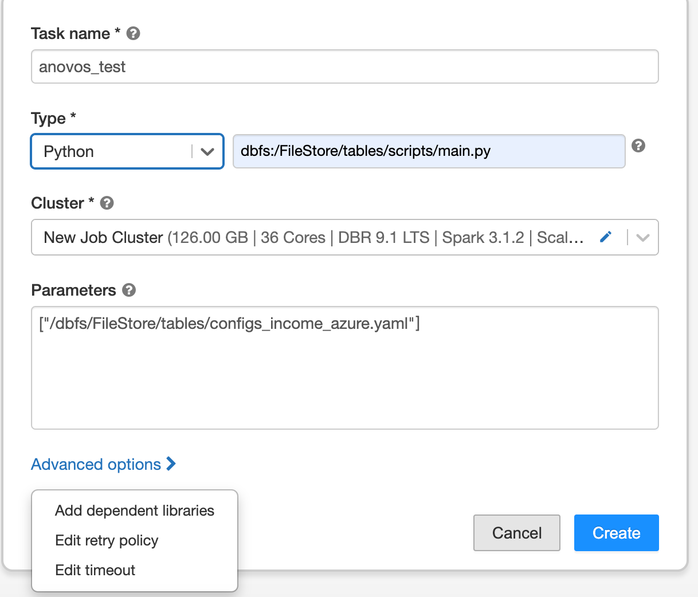

# Setting up Anovos on Azure Databricks

[Azure Databricks](https://azure.microsoft.com/services/databricks/)
is a hosted version of [Apache Spark](https://spark.apache.org/) on [Microsoft Azure](https://azure.microsoft.com/).
It is a convenient way to handle big data workloads of Spark without having to set up and maintain your own cluster.

To learn more about Azure Databricks, have a look at
[the official documentation](https://databricks.com/introducing-azure-databricks)
or the following introductory tutorials:

- [A beginner’s guide to Azure Databricks](https://www.sqlshack.com/a-beginners-guide-to-azure-databricks/)
- [Azure Databricks Hands-on](https://medium.com/@jcbaey/azure-databricks-hands-on-6ed8bed125c7)

Currently, _Anovos_ supports two ways of running workflows on Azure Databricks:

1. Processing datasets stored directly on DBFS
2. Processing datasets stored on [Azure Blob Storage](https://azure.microsoft.com/services/storage/blobs/)

Generally, we recommend the first option, as it requires slightly less configuration.
However, if you're already storing your datasets on Azure Blob Storage, mounting the respective containers
to DBFS allows you to directly process them with _Anovos_.

## 1. _Anovos_ on Azure Databricks using DBFS

The following steps are required for running _Anovos_ workloads on Azure Databricks that process datasets stored
on DBFS.

### Step 1.1: Installing _Anovos_ on Azure Databricks

To make _Anovos_ available on Azure Databricks, you need to provide access to the _Anovos_ Python package.

The easiest way is to point Azure Databricks to the
[current release of _Anovos_ on the Python Package Index (PyPI)](https://pypi.org/project/anovos/).
(This is where `pip install anovos` goes to fetch _Anovos_ when installing from the terminal.)
This has the advantage that you will get a well-tested and stable version of _Anovos_. We recommend this option.
If you choose this option then you can directly go to Step 2.

But if you need to make custom modifications to _Anovos_ or need access to new features or bugfixes that have
not been released yet, you can choose any of the options below.
(We will configure Azure Databricks to retrieve the correct _Anovos_ Python package as part of Step 4.)

#### Alternative: Manually uploading a wheel file

Instead of pointing Azure Databricks to the Python Package Index (PyPI),
you can make _Anovos_ available by downloading the respective wheel file
from PyPI yourself and manually uploading it to Azure Databricks.

You'll find the link to the latest wheel file on
[the "Download files" tab](https://pypi.org/project/anovos/#files), it's the file with the extension `.whl`
(for example: `anovos-1.0.1-py3-none-any.whl`).
If you'd like to use an older version, you can navigate to the respective version in the
[release history](https://pypi.org/project/anovos/#history) and access the "Download files" tab
from there.

Download the _Anovos_ wheel file to your local machine and move on to Step 2.

#### Alternative: Use a development version of _Anovos_

If you would like to try the latest version of _Anovos_ on Azure Databricks
(or would like to make custom modifications to the library),
you can also create a wheel file yourself.

First, clone the _Anovos_ GitHub repository to your local machine:

```shell
git clone --depth 1 <https://github.com/anovos/anovos.git>
```

💡 _Using the `--branch` flag allows you to select a specific release of Anovos._
   _For example, adding `--branch v1.0.1` will give you the state of the 1.0.1 release._
   _If you omit the flag, you will get the latest development version of Anovos, which might not_
   _be fully functional or exhibit unexpected behavior._

After cloning, go to the `anovos` directory that was automatically created in the process
and execute the following command to clean and prepare the environment:

```shell
make clean
```

It is a good practice to always run this command prior to generating a wheel file or another kind
of build artifact.

💡 _To be able to create a wheel file, `wheel`, `build`, and `setuptools` need to be installed_
   _in the current Python environment. You can do so by running `pip install build wheel setuptools`._

Then, to create the wheel file, run the following command directly inside the `anovos` folder:

```shell
python -m build --wheel --outdir dist/ .
```

Once the process is finished, the folder `dist` will contain the wheel file.
It will have the file extension `*.whl` and might carry the latest version in its name.

💡 _The version in the file name will be that of the latest version of Anovos,_
   _even if you cloned the repository yourself and used the latest state of the code._
   _This is due to the fact that the version is only updated right before new release is published._
   _To avoid confusion, it's a good practice to rename the wheel file to a custom name._

### Step 1.2: Prepare and copy the workflow configuration and data to DBFS

To run an _Anovos_ workflow, both the data to be processed and the workflow configuration
need to be stored on DBFS.

You can either use the UI or the CLI to copy files from your local machine to DBFS.
For detailed instructions, see the respective subsections below.

In this tutorial, we will use the "income dataset" and an accompanying pre-defined workflow.

You can obtain these files by cloning the _Anovos_ GitHub repository:

💡 _Note that you need to use the dataset version and workflow configuration files from the same _Anovos_ version_
   _that you have set up in Step 2.1._
   _Sometimes the version on PyPI that you obtain when running `pip install anovos` version is older than the latest_
   _development version on GitHub._

```shell
git clone https://github.com/anovos/anovos.git
```

You'll find the dataset under `examples/data/income_dataset` and the configuration file
under `config/configs_income_azure.yaml`.
You'll also need the `metric_dictionary.csv` file found under `data/`.

The `configs_income_azure.yaml` file contains the definition of the _Anovos_ workflow.
(To learn more about this file, see [📖 Configuring Workloads](../config_file.md).)

First, you should have a look at the configured input paths to make sure that _Anovos_ can find the data to be processed.
It is also important to check that the output paths are set to a location on DBFS that suits your needs.

For example, in the `input_dataset` block, you can see that by default the `file_path` is set to
`dbfs:/FileStore/tables/income_dataset/csv/`.
If you would like to store your data at a different location, you need to adapt this path accordingly.

Output paths are defined in several blocks.

The output path for the report data is specified as `master_path` in the blocks `report_preprocessing` and
`report_generation`.
The path for the report is specified as `final_report_path` in the `report_generation` block.
In this tutorial, by default, all these paths are set to `dbfs:/FileStore/tables/report_stats`.

The location where the processed data is stored is given by `file_path` in the blocks `write_main`,
`write_intermediate`, and `write_stats`.
In this tutorial, by default, these are set to sub-folders of `dbfs:/FileStore/tables/result`.

Finally, you need to ensure that the path to the `metric_dictionary.csv` file as well as the
`data_dictionary.csv` file, which is part of the "income dataset", are correctly specified in the
`report_generation` block.

You can also make other changes to the workflow.
For example, you can define which columns from the input dataset are used in the workflow.
To try it yourself, find the `delete_column` configuration in the `input_dataset` block and add the column `workclass`
to the list of columns to be deleted:

```yaml
delete_column: ['logfnl','workclass']
```

To learn more about defining workflows through config files, see
[📖 Configuring Workloads](../config_file.md).

Once the `configs_income_azure.yaml` file is complete, you can copy this file and the dataset to DBFS.
For this, you can choose to either upload the files through the UI or use the Azure Databricks CLI.
We describe both options in the following sections.

In any case, make sure that you place the data files in the location defined in the configuration file.
You should also remember the location of the `configs_income_azure.yaml`, as you will need this information
in the subsequent steps.

(For this tutorial, we have decided to place all files under `dbfs:FileStore/tables/`.)

#### Copying files to DBFS using the UI


1. Launch the Azure Databricks workspace.
2. Enter the data menu.
3. Upload files by dragging files onto the marked area or click on it to upload using the file browser.

For more detailed instructions, see the
[Databricks documentation](https://docs.microsoft.com/azure/databricks/data/databricks-file-system#dbfs-and-local-driver-node-paths).

#### Copying files to DBFS using the CLI

1. Install `databricks-cli` into a local Python environment by running `pip install databricks-cli`.
2. Generate a personal access token for your Databricks workspace by going to _Settings_ > _User Settings_ >
   _Generate new token_. For details, see the
  [Databricks documentation](https://docs.microsoft.com/azure/databricks/dev-tools/api/latest/authentication).
3. Configure the CLI to access your workspace by running `databricks configure --token`.
4. Enter the URL of the databricks host (the domain of your workspace,
   usually of the pattern `https://<UNIQUE ID OF YOUR WORKSPACE>.azuredatabricks.net/`) and the token when prompted
   for it.
5. To verify the configuration, run `databricks fs ls` and check whether you are able to see the files stored on DBFS.
6. Then copy the files using the `dbfs cp` command:

For example:

```shell
dbfs cp anovos/config/configs_income_azure.yaml dbfs:/FileStore/tables/configs_income_azure.yaml
dbfs cp anovos/data/metric_dictionary.csv dbfs:/FileStore/tables/metric_dictionary.csv
dbfs cp -r anovos/examples/data/income_dataset dbfs:/FileStore/tables/income_dataset
```

For more information on the Databricks CLI, see the
[Databricks documentation](https://docs.microsoft.com/azure/databricks/dev-tools/cli/).

### Step 1.3: Create a workflow script

To launch the workflow on Azure Databricks, we need a single Python script as the entry point.
Hence, we'll create a `main.py` script that invokes the _Anovos'_ workflow runner:

```python
import sys
from anovos import workflow

workflow.run(config_path=sys.argv[1], run_type="databricks")
```

Upload this script to DBFS as well using either of the methods described above.
Again, you can place this file at a location of your choosing.
In this tutorial, we have placed it at `dbfs:/FileStore/tables/scripts/main.py`.

### Step 1.4: Configure and launch an _Anovos_ workflow as a Databricks job

There are several types of jobs available on the Azure Databricks platform.
For _Anovos_, the following job types are suitable choices:

- **"Python:"** The job runs from a single Python script. _Anovos_ and the required Scala
  dependencies are installed through the respective package repositories.

- **"Spark Submit:"** The job is invoked through a bare `spark-submit` call. The installation
  of _Anovos_  is handled by a cluster initialization script and the required Scala dependencies
  have to be provided as JAR files through DBFS.

  Note that there are several limitations for "Spark Submit" tasks:
  You can only run them on new clusters and autoscaling is not available.
  For more information, see the [Databricks documentation on jobs](https://docs.microsoft.com/azure/databricks/data-engineering/jobs/jobs).

  Unless you require the fine-grained control that this option offers with regard to
  cluster initialization and `spark-submit` options, we recommend to select "Python" as the
  job type.

#### 1.4.1: Using the "Python" job type

Once all files have been copied to DBFS, we can create an Azure Databricks job
that starts a cluster and launches the _Anovos_ workflow.

Here's an example of a job configuration:


You can see that we set the "Type" to "Python" and have provided the path of the `main.py` script.
In the parameters section, we pass the DBFS path of the config file.

The cluster configuration comprises settings for the Databricks Runtime, the number of workers,
worker and driver types, as well as the cluster's scaling behavior.

Here's an example of a cluster configuration for this tutorials:


For more detailed information, refer to the
[Databricks documentation](https://docs.microsoft.com/azure/databricks/clusters/configure#cluster-configurations).

To give the Databricks platform access to _Anovos_, click on "Advanced options" and select "Add dependent libraries"
in the _Job Configuration Window_.

If you chose the default way of obtaining _Anovos_ directly from the Python Package Index,
select "PyPI" as the "Library Source" and enter `anovos` as the "Package":


💡 _In case you encounter the error `"ImportError: cannot import name 'soft_unicode' from 'markupsafe'"`_
   _while running the job, then you need to add `markupsafe==2.0.1` as another dependency from PyPI._


If you chose to provide your own wheel file, select "Upload" as the library source and follow the instructions.

In addition to the _Anovos_ wheel file, we need to provide the `histogrammar` package to Azure Databricks.
_Anovos_ uses this library internally to compute correlation matrices.

Following the same procedure as for _Anovos_, you can add `histogrammar` as a dependent library.
This time, we use "Maven" as the "Library Source".

Then, select `io.github.histogrammar:histogrammar-sparksql_2.12:1.0.20`
and `io.github.histogrammar:histogrammar_2.12:1.0.20` as the "Coordinates"
(copy the coordinate one by one, paste in Coordinates box and then add it by clicking on Install button):


(In case you're running _Anovos_ on Spark 2.4.x, you need to add
`io.github.histogrammar:histogrammar-sparksql_2.11:1.0.20` and `io.github.histogrammar:histogrammar_2.11:1.0.20`)

Once the job is configured, click "Create" to instantiate it.
Then, you'll see the full task configuration:


On the subsequent screen, click on "Run now" to launch the job:


For more information on creating and maintaining jobs, see the
[Databricks documentation](https://docs.microsoft.com/azure/databricks/jobs).

#### 1.4.2: Using the "Spark Submit" job type

_Anovos_ internally uses the `histogrammar` library to compute correlation matrices.
Hence, we need to provide the package to Azure Databricks.

As the "Spark Submit" job type requires any dependency to be available through DBFS,
you first need to upload the `histogrammar` JAR files to DBFS.

If you're using Spark 3.x, download the following files and upload them to DBFS:

- [`io.github.histogrammar.histogrammar_2.12-1.0.20.jar`](https://mvnrepository.com/artifact/io.github.histogrammar/histogrammar_2.12/1.0.20)
- [`io.github.histogrammar.histogrammar-sparksql_2.12-1.0.20.jar`](https://mvnrepository.com/artifact/io.github.histogrammar/histogrammar-sparksql_2.12/1.0.20)

If you're using Spark 2.x, download the following files and upload them to DBFS:

- [`io.github.histogrammar.histogrammar_2.11-1.0.20.jar`](https://mvnrepository.com/artifact/io.github.histogrammar/histogrammar_2.11/1.0.20)
- [`io.github.histogrammar.histogrammar-sparksql_2.11-1.0.20.jar`](https://mvnrepository.com/artifact/io.github.histogrammar/histogrammar-sparksql_2.11/1.0.20)

Once these files have been uploaded to DBFS, we can create an Azure Databricks job
that starts a cluster and launches the _Anovos_ workflow.

Here's an example of a job configuration:


You can see that we set the "Type" to "Spark Submit".

In the parameters section, we pass the DBFS paths of the `histogrammar` JAR files, the sample class,
the `main.py` script, and configuration file.

For example:

```json
["--jars","dbfs:/FileStore/tables/histogramm_jar/histogrammar_sparksql_2_12_1_0_20.jar,dbfs:/FileStore/tables/histogramm_jar/histogrammar_2_12_1_0_20.jar","--class","org.apache.spark.examples.SparkPi","/dbfs/FileStore/tables/scripts/main.py","/dbfs/FileStore/tables/configs_income_azure.yaml"]
```

The cluster configuration comprises settings for the Databricks Runtime, the number of workers,
worker and driver types.
(Note that autoscaling is not available for "Spark Submit" jobs on Azure Databricks.)

Here's an example of a cluster configuration for this tutorial:


For more detailed information, refer to the
[Databricks documentation](https://docs.microsoft.com/azure/databricks/clusters/configure#cluster-configurations).

To give the Databricks platform access to _Anovos_, you need to create a shell script that is executed upon cluster
initialization and fetches the package from PyPI.

The `anovos_packages.sh` script contains just one line:

```bash
sudo pip3 install anovos
```

Note that you should specify the version of _Anovos_ if you're running production workloads
to ensure reproducibility:

```bash
sudo pip3 install anovos==1.0.1
```

Place this script on DBFS as well.

During cluster configuration, click on "Advanced options"
and specify the path to the script in the "Init Script" section:


To enable logging, configure a DBFS path in the "Log" section:


Once the job is configured, click "Create" to instantiate it.

On the subsequent screen, click on "Run now" to launch the job:


For more information on creating and maintaining jobs, see the
[Azure Databricks documentation](https://docs.microsoft.com/azure/databricks/jobs).

### Step 1.5: Retrieve the output

Once the job finishes successfully, it will show up under "Completed runs".

The intermediate data and the report data are saved at the `master_path` and the `final_report_path`
specified in the `configs_income_azure.yaml` file.
In this tutorial, we have set these paths to `dbfs:FileStore/tables/report_stats/`.

To retrieve the HTML report and the report data, you can either go to this path in the UI and copy the files,
or use the CLI to copy everything to your local machine:

```shell
dbfs cp -r dbfs:/FileStore/tables/report_stats/ ./
```

For more details regarding accessing files on DBFS, see the instructions on uploading files to DBFS in Step 2.

## 2. Anovos on Azure Databricks Using an Azure Blob Storage Container Mounted to DBFS

### Step 2.1: Installing/Downloading Anovos

This step is identical to
[Step 1.1: Installing _Anovos_ on Azure Databricks](#step-11-installing-anovos-on-azure-databricks).

### Step 2.2: Copy the dataset to an Azure Blob Storage container

To run an _Anovos_ workflow, the dataset needs to be stored on an Azure Blob Storage container.
You can either use the UI by clicking the upload button or the CLI to copy files from your local machine
to an Azure Blob Storage container.
For detailed instructions, see the respective subsections below.

In this tutorial, we will use the "income dataset" provided with _Anovos_ and an accompanying pre-defined workflow.
You can obtain these files by cloning the _Anovos_ GitHub repository:

```shell
git clone https://github.com/anovos/anovos.git
```

Afterwards, you'll find the dataset under `examples/data/income_dataset`

💡 _Note that you need to use the dataset version and workflow configuration files from the same _Anovos_ version_
   _that you have set up in Step 2.1._
   _Sometimes the version on PyPI that you obtain when running `pip install anovos` version is older than the latest_
   _development version on GitHub._

The syntax to upload a file using the command line are as follows:

```shell
azcopy copy source_file "<storage-account-name>.blob.core.windows.net/<container-name>?<sas-token>"
```

To learn more about transferring data to Azure Blob Storage containers, please refer to the
[Azure documentation](https://docs.microsoft.com/en-us/azure/storage/common/storage-use-azcopy-files).

### Step 2.3: Mount an Azure Blob Storage Container as a DBFS path in Azure Databricks

To access files in an Azure Blob Storage container for running _Anovos_ in Azure Databricks platform,
you need to mount that container in the DBFS path.

To mount the Azure Blob Storage container, execute the following commands in an Azure Databricks notebook:

```python
dbutils.fs.mount(
    source = "wasbs://<container-name>@<storage-account-name>.blob.core.windows.net",
    mount_point = "/mnt/<mount-name>",
    extra_configs = {"fs.azure.sas.<container-name>.<storage-account-name>.blob.core.windows.net":"<sas-token>"})
```

Here,
- `<storage-account-name>` is the name of your Azure Blob Storage account
- `<container-name>` is the name of a container in your Azure Blob Storage account
- `<mount-name>` is the DBFS path where the Blob Storage container or a folder inside the container will be mounted to
- `<sas_token>` is the SAS token for that storage account

To learn more about mounting Azure Blob Storage containers in DBFS, please refer to
[the Azure Blob Storage documentation](https://docs.microsoft.com/en-us/azure/databricks/data/data-sources/azure/azure-storage).

💡 _Note that you only need to mount the container once._
   _The container will remain mounted at the given mount point._
   _To unmount a container, you can run `dbutils.fs.unmount("/mnt/<mount-name>")` in an Azure Databricks notebook._

### Step 2.4: Update the workflow configuration for all input and output paths according to the DBFS mount point

Once mounting is completed, the data is present in DBFS at the path specified as the mount point.
All operations performed by _Anovos_ when running a workflow will result in changes in the data stored in the
Azure Blob Storage container.

The example configuration file we use in this tutorial can be found at `config/configs_income_azure_blob_mount.yaml`
in the _Anovos_ repository.
It will need to be updated to reflect the path of the mount point set above.

In order for _Anovos_ to be able to find the input data and write the output to the correct location,
update all paths to contain the path of the mount point:

```yaml
file_path: "dbfs:/mnt/<mount-name>/..."
```

🤓 _Example:_

```yaml
  read_dataset:
    file_path: "dbfs:/mnt/anovos1/income_dataset/csv/"
    file_type: csv
```

Here, the mount points is `dbfs:/mnt/anovos1` and the input dataset is stored in a folder called `income_dataset/csv`
within the Azure Blob Storage container.

To learn more about the _Anovos_ workflow configuration file and specifying paths for input and output data,
have a look at the [Configuring Workloads](../config_file.md) page.

### Step 2.5: Copy the updated configuration file from the local machine to the Azure Blob Storage container

Once you have updated the configuration file, copy it to Azure Databricks using the same command that was used
in [Step 2.2](#step-22-copy-the-dataset-to-an-azure-blob-storage-container).

### Remaining Steps

The remaining steps are the same as above, so please continue with
[Step 1.4](#step-14-configure-and-launch-an-anovos-workflow-as-a-databricks-job)

## 3. Anovos on Azure Databricks using direct access to Azure Blob Storage containers 

### Step 3.1: Installing/Downloading Anovos

This step is identical to
[Step 1.1: Installing _Anovos_ on Azure Databricks](#step-11-installing-anovos-on-azure-databricks).

### Step 3.2: Copy the dataset to an Azure Blob Storage container

This step is identical to
[Step 2.2: Copy the dataset to an Azure Blob Storage container](#step-22-copy-the-dataset-to-an-azure-blob-storage-container).

### Step 3.3: Add the secret to the Spark configuration

To access files in an Azure Blob Storage container for running _Anovos_ on the Azure Databricks platform,
you need to either add the Storage account key or an SAS token to the Spark cluster configuration.

The following command adds the Storage account key to the Spark cluster configuration: 

```spark.conf.set("fs.azure.account.key.<storage-account-name>.dfs.core.windows.net", <storage-account-key>```

Here,
- `<storage-account-name>` is the name of your Azure Blob Storage account
- `<storage-account-key>` is the value of the Storage account key (TODO: this is bad practice and should be solved with a secret)

You can access the contents of a storage account using an SAS token as well.

The following commands add the generated SAS token to the Spark cluster configuration:

```
spark.conf.set("fs.azure.account.auth.type.<storage-account-name>.dfs.core.windows.net", "SAS")
spark.conf.set("fs.azure.sas.token.provider.type.<storage-account-name>.dfs.core.windows.net", "org.apache.hadoop.fs.azurebfs.sas.FixedSASTokenProvider")```
spark.conf.set("fs.azure.sas.fixed.token.<storage-account-name>.dfs.core.windows.net", "<sas-token>")
```

To learn more about accessing Azure Blob Storage containers using the `abfss` protocol, please refer to
[the Azure Blob Storage documentation](https://docs.microsoft.com/en-us/azure/databricks/data/data-sources/azure/azure-storage).

### Step 3.4: Update the input and output paths in the _Anovos_ workflow configuration

The input and output paths need to be prefixed with the following value: 

```abfss://<container-name>@<storage-account-name>.dfs.core.windows.net/```

Here,
- `<storage-account-name>` is the name of your Azure Blob Storage account
- `<storage-account-key>` is the value of the Storage account key (TODO: this is bad practice and should be solved with a secret)

The example configuration file we use in this tutorial can be found at `config/configs_income_azure_blob_mount.yaml`
in the [_Anovos_ GitHub repository](https://github.com/anovos/anovos).
It will need to be updated to reflect the path of the Azure Blob Storage container's mount point set above.

In order for _Anovos_ to be able to find the input data and write the output to the correct location,
update all paths to contain the path of the mount point:

```yaml
file_path: "abfss://<container-name>@<storage-account-name>.dfs.core.windows.net/..."
```

🤓 _Example:_

```yaml
  read_dataset:
    file_path: "abfss://<container-name>@<storage-account-name>.dfs.core.windows.net/income_dataset/csv/"
    file_type: csv
```

Here, the URL points to the Storage container and account
`abfss://<container-name>@<storage-account-name>.dfs.core.windows.net/`
and the input dataset is stored in a folder called `income_dataset/csv` within the Azure Blob Storage container.

To learn more about the _Anovos_ workflow configuration file and specifying paths for input and output data,
have a look at the [Configuring Workloads](../config_file.md) page.

### Step 3.5: Copy the updated configuration file to Databricks DBFS

Once you have updated the configuration file, copy it to Azure Databricks using the same command that was used
in [Step 1.2](#step-12-prepare-and-copy-the-workflow-configuration-and-data-to-dbfs).

You can now configure the `file_path` to point to that location.

### Remaining Steps

The remaining steps are the same as above, so please continue with
[Step 1.4](#step-14-configure-and-launch-an-anovos-workflow-as-a-databricks-job)


