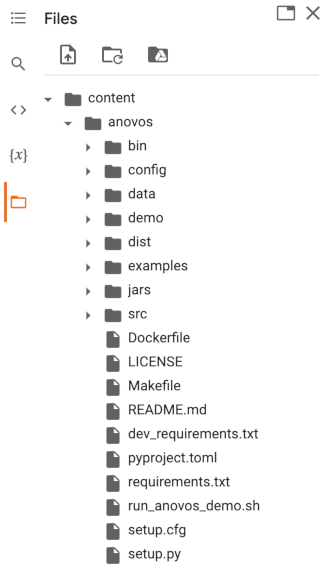

# Setting Up Anovos on Google Colab

[https://colab.research.google.com/ Colab] is an offer by Google Research 
that provides access to cloud-hosted [Jupyter notebooks](https://jupyter.org/) 
for collaborating on and sharing data science work.

Colab offers substantial compute resources even in its free tier and is integrated with
[Google Drive](https://drive.google.com/), 
making it an excellent place to explore libraries like _Anovos_ without setting up anything
on your local machine.

If you're not yet familiar with Google Colab, the following selection of introductory tutorials
are an excellent starting point to familiarize yourself with this platform:

- Vishaka Lall: [Google Colab — The Beginner’s Guide](https://medium.com/lean-in-women-in-tech-india/google-colab-the-beginners-guide-5ad3b417dfa) (Lean In Women In Tech India)
- Souvik Mandal: [How to use Google Colab](https://www.geeksforgeeks.org/how-to-use-google-colab/) (GeeksforGeeks)
- Bala Priya C: [Google Colab Tutorial for Data Scientists](https://www.datacamp.com/community/tutorials/tutorial-google-colab-for-data-scientists) (Datacamp)

## Step-by-step Instructions for Using _Anovos_ on Google Colab

The following four steps will guide you through the entire setup of _Anovos_
on Google Colab.

The instructions assume that you're starting out with a fresh, empty notebook environment.

### Step 1: Installing Spark dependencies

_Anovos_ builds on [Apache Spark](https://spark.apache.org/), which is not available by default in Google Colab.
Hence, before we can start working _Anovos_, we need to install Spark and set up a Spark environment.

Since Spark is a Java application, we start out by installing the Java Development Kit:

```shell
!apt-get install openjdk-8-jdk-headless -qq > /dev/null
```

Then, we can download Spark:

```shell
!wget https://archive.apache.org/dist/spark/spark-2.4.8/spark-2.4.8-bin-hadoop2.7.tgz
```

_**Note**: In this tutorial, we use Java 8 and Spark 2.4.8. You can use more recent versions as well._
_See the [list of currently supported versions](locally.md#software-prerequisites) to learn about available options._
   
Next, unzip the downloaded Spark archive to the current folder:

```shell
!tar xf spark-2.4.8-bin-hadoop2.7.tgz
```

Now we'll let the Colab notebook know where Java and Spark can be found by setting the corresponding
environment variables:

```python
import os
os.environ["JAVA_HOME"] = "/usr/lib/jvm/java-8-openjdk-amd64"
os.environ["SPARK_HOME"] = "/content/spark-2.4.8-bin-hadoop2.7"
```

To access Spark through Python, we need the `pyspark` library as well as the `findspark` utility:

```shell    
!pip install findspark pyspark==2.4.8
```
_**Note**: Make sure that the version of `pyspark` matches the Spark versions you downloaded._

## Step 2: Installing _Anovos_ and its dependencies

Clone the _Anovos_ GitHub repository to Google Colab:

```shell
!git clone --branch v0.2.1 https://github.com/anovos/anovos.git
```
_**Note**: Using the `--branch` flag allows you to select the desired release of Anovos._
_If you omit the flag, you will get the latest development version of Anovos, which might not_
_be fully functional or exhibit unexpected behavior._

After cloning, let's enter the newly created _Anovos_ directory:
```shell
cd anovos
```
As indicated by the output shown, _Anovos_ was placed in the folder `/content/anovos`,
which you can also access through the sidebar:


The next step is to build _Anovos_:
```shell
!make clean build
```
    
As the final step before we can start working with _Anovos_,
we need to install the required Python dependencies:

```shell
!pip install -r requirements.txt
```
    
## Step 3: Configuring an _Anovos_ workflow

_Anovos_ workflows are configured through a YAML configuration file.
To learn more, have a look at the exhaustive [Configuring Workflows](../config_file.md) documentation.

But don't worry: We'll guide you through the necessary steps!

First, open the file viewer in the sidebar and download the `configs.yaml` file from the `dist` folder
by right-clicking on the file and selecting _Download_:


After downloading the config file, the user can specify the input against the respective arguments dedicated to the individual modules / functions inside the [config_file], thereby enabling anovos to run through the relevant modules from the main.py file based on the desirable workflow 

For updating config file, user can refer for more details from [config_file_docs](../config_file.md) for specifying the input against the respective argumnets.

Once you updates the config file, you can upload it again by right-clicking on the `dist` folder
and selecting _Upload_:


Users need to change config file that is already detailed above. Apart from that user can change main.py if they want different functions from Anovos that can be stitched together to create a workflow differently. If necessary, Users can update spark-submit.sh ie, Users can change number of executors, executor memory , driver memory and other parameters present in spark-submit.sh as per dataset size and resources availability.
  - > Update the input and output paths in configs.yaml and configure
    > the data set. You might also want to adapt the threshold settings
    > to your needs.

  - > Adapt the main.py sample script. It demonstrates how different
    > functions from *Anovos* can be stitched together to create a
    > workflow.

  - > If necessary, update spark-submit.sh. This is the shell script
    > used to run the Spark application via spark-submit.

## Step 4: Trigger a workflow run

Once the workflow configuration has been uploaded, you can run your workflow by entering the
`dist` directory and running `spark-submit.sh`:
```shell
cd dist
!nohup ./spark-submit.sh > run.txt &
```

The `nohup` command together with the `&` at the end of line ensures that the workflow is executed
in the background, allowing us to continue working in the Colab notebook.

To see what your workflow is doing, have a look at `run.txt`, where all logs are collected:
```shell
!tail -f run.txt
```

Once the run completes, the reports generated by _Anovos_ and all intermediate outputs are
stored at the specified path.

The intermediate data & report data typically gets saved at the master_path & the final_report_path as specified by the user inside the [config_file]. The aforementioned data is available upon completion of respective modules.
