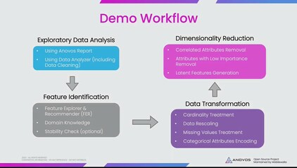
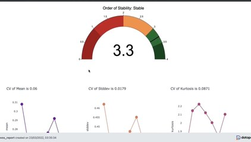
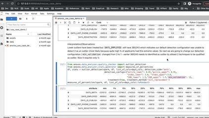
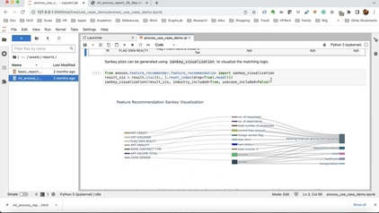
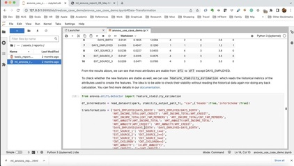

# The Anovos Workflow

We designed _Anovos_ with an end-to-end machine learning workflow mind.
Teams can use _Anovos_ either as the foundation of their entire workflow or use functions from the library
as part of an existing pipeline.

For example, an organization might have an end-to-end workflow that lacks components offered by _Anovos_.
The organization can incorporate additional components by a simple API call for a function from _Anovos_.

The following workflow diagram shows the potential ways to use Anovos in an end-to-end workflow settings:

## _Anovos_ Feature Engineering Video Series

We have created a series of videos that walk through a typical _Anovos_ feature engineering workflow.

- Video 1: [**Introduction to Feature Engineering with Anovos**](https://www.youtube.com/watch?v=ihXpAY_tKHI)\
  
- Video 2: [**Exploratory Data Analysis Using Reports**](https://www.youtube.com/watch?v=9UXxJ7I3Y8E)\
  
- Video 3: [**Exploratory Data Analysis with the Data Analyzer**](https://www.youtube.com/watch?v=E68pZp8TboY)\
  
- Video 4: [**Feature Composition in Anovos**](https://www.youtube.com/watch?v=Tgp974LcLcc)\
  
- Video 5: [**Producing Model Ready Features**](https://www.youtube.com/watch?v=A0-Rdy5mnl4)\
  

## _Anovos_ Workshop

You can find the material for a comprehensive introductory workshop as part of the _Anovos_ GitHub repository:
[https://github.com/anovos/anovos/tree/main/tutorial](https://github.com/anovos/anovos/tree/main/tutorial).

The accompanying
[documentation](https://github.com/anovos/anovos/blob/main/tutorial/Documentation/ANOVOS_Workshop_Doc_2_0.pdf)
walks you through installing _Anovos_ and using it as part of an end-to-end feature engineering workflow.

If you would like to receive hands-on training in _Anovos_ for your team, don't hesitate to
[reach out to us](../community/communication.md).
