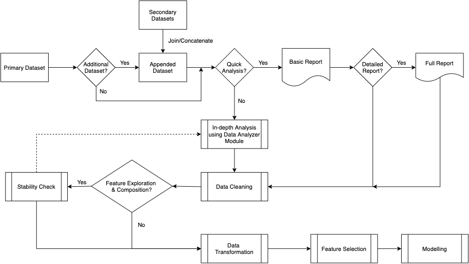

# The Anovos Workflow

We designed _Anovos_ with an end-to-end machine learning workflow mind.
Teams can use _Anovos_ either as the foundation of their entire workflow or use as part of an existing pipeline.

For example, an organization might have an end-to-end workflow that lacks components offered by _Anovos_.
The organization can incorporate additional components by a simple API call for a function from _Anovos_.

The following workflow diagram shows the potential ways to use Anovos in an end-to-end workflow settings:

